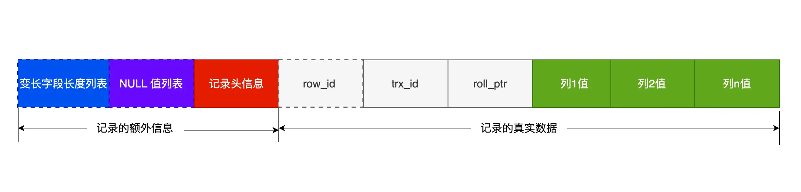

MySQL 是一个开源的关系型数据库管理系统，使用 SQL（结构化查询语言）进行数据操作。

## 目录

---

## 1. MySQL 架构

> **MySQL 的架构分为两层：服务器层和存储引擎层。服务器层负责处理 SQL 语句、连接管理、权限控制等，所有的内置函数和跨存储引擎的功能都在这里实现。而存储引擎层负责数据的实际存储和检索，支持多种存储引擎，如 InnoDB、MyISAM、Memory 等。多个不同的存储引擎可以在同一个 MySQL 实例中共存，共用一个 Server 层。**


就 SELECT 查询语句，客户端首先发起连接 `mysql -h host -u user -p`，连接器（Connector）检验用户权限，查询缓存（MySQL 8.0后不支持），未命中则进入解析器将 SQL 语句解析为语法树。

在执行查询语句阶段，首先由预处理器（Preprocessor）检查表和字段、展开试图（View）和存储过程（Stored Procedure）、绑定参数等。然后由优化器（Optimizer）生成执行计划，选择最优的索引和连接方式。最后由执行器（Executor）执行查询，与存储引擎（Storage Engine）交互，获取数据。

MySQL 基于 TCP 协议传输数据，连接器负责验证用户名和密码 `mysql -u root -p xxx`、管理用户权限、连接状态等。解析器负责语法分析（提取 Token 和 Keyword）、语法分析（构建语法树）。执行语句的流程分为三个阶段：预处理、优化、执行。预处理阶段负责判断表/字段是否存在，优化阶段负责确定执行方案，执行阶段负责执行 SQL 语句并返回结果。

1. **主键索引查询**：通过主键索引（聚簇索引）直接定位并获取数据行，效率最高。
2. **全表扫描**：当没有可用索引或查询条件无法利用索引时，MySQL 会遍历整张表的所有数据行，效率较低。
3. **索引下推（Index Condition Pushdown, ICP）**：在使用二级索引（非主键索引）时，MySQL 会将部分 WHERE 条件下推到存储引擎层，在扫描索引时提前过滤不满足条件的记录，减少回表次数，提高查询效率。

## 2. 表数据的存储

MySQL 数据库文件默认存放在 `/var/lib/mysql/` 目录下。每个数据库对应一个文件夹，表的数据和元数据主要存储在 `.ibd` 文件（InnoDB 独立表空间）或共享表空间（如 `ibdata1`）中。  
`.ibd` 文件包含表的数据页、索引页、元数据等。表空间由**段、区、页、行**组成。
 
> 段是逻辑上的数据存储单元，一般分为**索引段**（非叶子节点的区的集合）和**数据段**（叶子节点的区的集合）。每个段由多个区组成。区是物理上的数据存储单元，通常为 64KB。每个区由多个页组成，每个页的大小通常为 16KB。页是最小的数据存储单元，包含实际的数据行。InnoDB 存储引擎使用 B+ 树来存储数据，以区为单位分配空间（将连续的 64 页分配在一起）。

InnoDB 提供 4 种行格式：**Compact**、**Redundant**、**Dynamic** 和 **Compressed**。其中 Redundant 已过时，Compact 是默认格式，Dynamic 和 Compressed 适用于大文本和 BLOB 数据。



compact 行格式将额外信息（如 NULL 位图、行头信息）存储在行的开头，数据列按顺序存储。变长字段所占用字节数会在行头逆序存储。其次 compact 将 NULL 值列以 NULL 位图的形式逆序存储，节省空间。

> MySQL 规定除了 TEXT 和 BLOB 对象类型外，其他类型的列都可以使用 compact 行格式存储（一行大小不能超过 65,535 字节）。TEXT 和 BLOB 类型的列只能使用 dynamic 或 compressed 行格式存储。

> 每个页的大小可以通过 `innodb_page_size` 参数进行配置，默认值为 16KB。当页中存储的数据超过 16KB 时，InnoDB 会将数据分割成多个页存储。行会存储一部分真实数据，用 20 字节的指针指向剩余数据所在的页。

## 3. 索引

数据库中的索引是用于快速查找数据的一种数据结构。MySQL 支持多种类型的索引，主要包括以下几种：

1. 数据结构型索引
   - **B+ 树索引**：适用于范围查询和排序操作。叶子节点存储数据或数据指针，非叶子节点只存储索引键和指针（指向子节点）。
   - **哈希索引**：适用于等值查询，但不支持范围查询。查找速度非常快，但在数据量较大时可能会出现哈希冲突。
   - **全文索引**：用于文本搜索，支持模糊匹配。
2. 物理特性型索引
   - **聚簇索引**：数据和主键索引存储在一起，叶子节点就是数据行本身。每个表只能有一个（通常是主键）。
   - **二级索引（非聚簇索引）**：索引和数据分开存储，叶子节点存储的是数据指针。可以有多个。
3. 字段型索引
   - **单列索引/多列索引（复合索引）**：单列：只索引一个字段。多列：索引多个字段，适合多条件查询。
   - **唯一索引**：索引列的值必须唯一，可以包含 NULL 值。
   - **普通索引**：没有唯一性约束，可以包含重复值。
   - **前缀索引**：对字符串类型的列创建索引时，可以只索引前几个字符，节省空间。
   - **主键索引**：主键列自动创建唯一索引，不能包含 NULL 值。

## 4. B+ 树

```cpp
// 非叶子节点结构体
typedef struct BPlusTreeInternalNode {
    int keyNum;                // 当前节点的键数量
    int keys[MAX_KEYS];        // 索引键数组
    struct BPlusTreeNode* children[MAX_KEYS + 1]; // 子节点指针数组
    bool isLeaf;               // 是否为叶子节点（false）
} BPlusTreeInternalNode;

// 叶子节点结构体
typedef struct BPlusTreeLeafNode {
    int keyNum;                // 当前节点的键数量
    int keys[MAX_KEYS];        // 索引键数组
    DataType values[MAX_KEYS]; // 数据指针或实际数据
    struct BPlusTreeLeafNode* next; // 指向下一个叶子节点（链表结构）
    bool isLeaf;               // 是否为叶子节点（true）
} BPlusTreeLeafNode;
```

### 4.1 通过二级索引的 B+ 树查询数据

1. 定位二级索引

二级索引的叶子节点存储主键值，非叶子节点存储索引键和子节点指针。通过二级索引的 B+ 树查找索引键，直到找到对应的主键值。

2. 回表查询数据

通过主键值在聚簇索引的 B+ 树中查找数据行。聚簇索引的叶子节点存储实际的数据行，直接返回数据。

