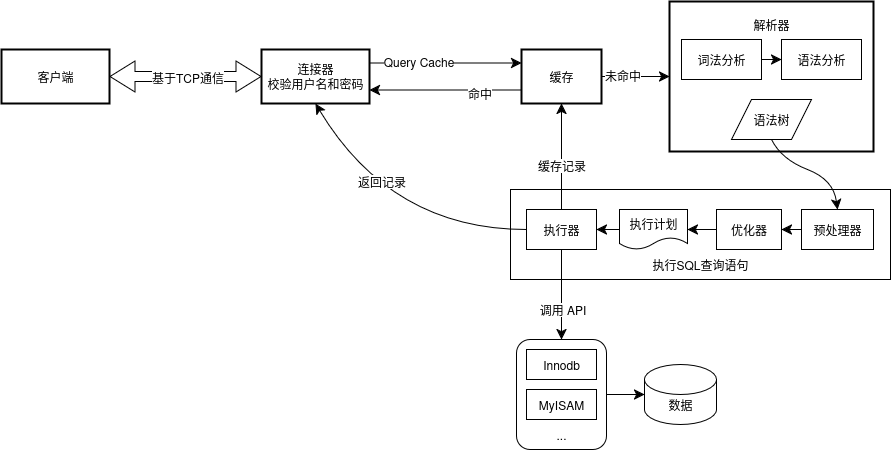

MySQL 是一个开源的关系型数据库管理系统，使用 SQL（结构化查询语言）进行数据操作。

## 目录

---

## 1. MySQL 架构

> **MySQL 的架构分为两层：服务器层和存储引擎层。服务器层负责处理 SQL 语句、连接管理、权限控制等，所有的内置函数和跨存储引擎的功能都在这里实现。而存储引擎层负责数据的实际存储和检索，支持多种存储引擎，如 InnoDB、MyISAM、Memory 等。多个不同的存储引擎可以在同一个 MySQL 实例中共存，共用一个 Server 层。**

就 SELECT 查询语句，客户端首先发起连接 `mysql -h host -u user -p`，连接器（Connector）检验用户权限，查询缓存（MySQL 8.0后不支持），未命中则进入解析器将 SQL 语句解析为语法树。

在执行查询语句阶段，首先由预处理器（Preprocessor）检查表和字段、展开试图（View）和存储过程（Stored Procedure）、绑定参数等。然后由优化器（Optimizer）生成执行计划，选择最优的索引和连接方式。最后由执行器（Executor）执行查询，与存储引擎（Storage Engine）交互，获取数据。