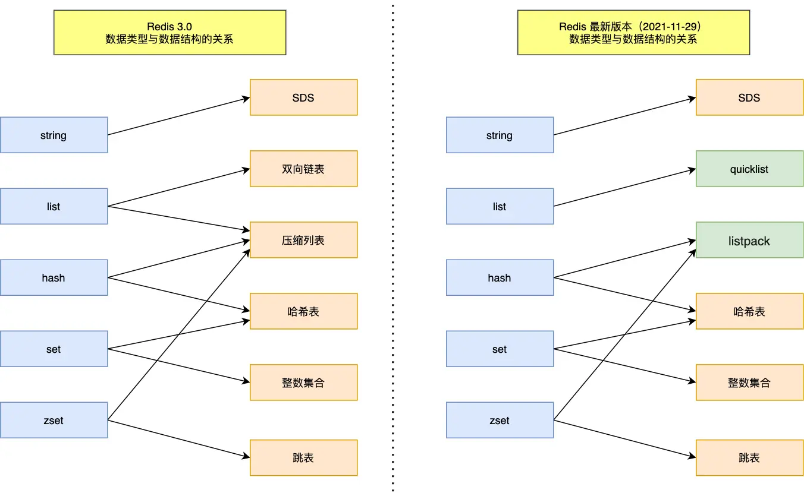

Redis 是一种基于内存的键值对存储系统，支持多种数据结构，如字符串、哈希、列表、集合、有序集合等。读写速度非常快，通常用于缓存、消息队列、实时分析等场景。对数据的操作都是原子性的，执行命令由单线程处理，避免了多线程的锁竞争问题。除此以外 Redis 还支持数据持久化、Lua 脚本，主从复制、哨兵模式和集群模式等功能。

> Redis 用作 MySQL 的缓存层，可以显著提升读性能，减轻数据库压力。Redis 的 QPS 能轻松突破 10w,而 MySQL 很难突破 1w。常见的缓存策略有：**Cache Aside**（应用程序主动管理缓存）、**Read Through**（缓存自动加载数据）、**Write Through**（写操作同时更新缓存和数据库）、**Write Back**（延迟写入数据库）。选择合适的缓存策略需要根据具体业务场景和数据访问模式来决定。

## 目录

## 1. Redis 数据类型

常见的五种数据类型有：字符串（String）、哈希（Hash）、列表（List）、集合（Set）、有序集合（Zset）。此外还有位图（Bitmap）、HyperLogLog、地理空间（Geospatial）等特殊数据类型。



### 1.1 字符串（String）

String 基于 SDS（Simple Dynamic String）实现，支持动态扩展和二进制安全。SDS 结构体包含：`len`（当前字符串长度）、`free`（预留空间长度）、`buf`（实际存储字符串的字符数组）。不仅可以存储普通字符串，还可以存储二进制数据（如图片、音频等）。

### 1.2 哈希（Hash）

Hash 基于字典（Dict）实现，适合存储对象类型的数据。Dict 采用哈希表结构，包含数组（table）、大小（size）、已使用槽位数（used）、哈希函数（hashFunction）、键比较函数（keyCompare）等。每个槽位存储一个链表或跳表，用于解决哈希冲突。

> 哈希表底层是一个数组，每个数组元素存储一个链表或跳表（称为**桶**），用于解决哈希冲突（所有哈希冲突的元素都存储在同一个桶中）。哈希函数将键映射到数组索引，键比较函数用于判断键是否相等。哈希表支持动态扩展，当负载因子（已使用槽位数/总槽位数）超过一定阈值时，会触发扩展操作，分配更大的数组并重新哈希已有元素。

### 1.3 列表（List）

List 基于双向链表（QuickList）实现，适合存储有序的字符串集合。QuickList 结合了双向链表和压缩列表（Ziplist）的优点，既支持快速插入和删除操作，又节省内存空间。每个节点存储一个 Ziplist，当节点数量超过一定阈值时，会拆分成多个节点。

### 1.4 集合（Set）

Set 基于字典（Dict）实现，适合存储唯一的字符串集合。Dict 采用哈希表结构，支持快速的添加、删除和查找操作。由于集合中的元素是唯一的，重复添加相同元素不会改变集合内容。

### 1.5 有序集合（Zset）
Zset 基于跳表（Skiplist）和字典（Dict）实现，适合存储带有分数的字符串集合。跳表是一种多层链表结构，支持快速的范围查询和排序操作。每个元素包含一个字符串和一个分数，跳表按分数排序，字典用于快速查找元素。


## 2. Redis 持久化

Redis 的读写操作都在内存中进行，为了防止数据丢失，Redis 提供了两种持久化方式：RDB（快照）和 AOF（追加文件）。RDB 会定期将内存中的数据快照保存到磁盘，而 AOF 会记录每次写操作并追加到日志文件中。

Redis 提供两种快照命令：`BGSAVE`（后台异步保存）和 `SAVE`（前台同步保存）。`BGSAVE` 会创建一个子进程来执行保存操作，主进程继续处理客户端请求；`SAVE` 会阻塞主进程，直到保存完成。通常推荐使用 `BGSAVE`，以避免阻塞客户端请求。RDB 采用全量保存方式，每次保存都会将内存中的所有数据写入到一个新的 RDB 文件中。RDB 数据恢复较快，但频率不好把握。

AOF 提供三种写入策略：`always`（每次写操作都同步写入磁盘，最安全但性能最低）、`everysec`（每秒同步写入一次，性能和安全性平衡）、`no`（不强制同步，依赖操作系统调度，性能最高但数据丢失风险最大）。默认策略是 `everysec`。Redis 主线程将写命令追加到 AOF 缓冲区，后台线程定期将缓冲区内容写入磁盘。为避免 AOF 文件过大，AOF 重写机制在记录完成后重新生成 AOF 文件，压缩和优化写入命令。为避免数据不一致，Redis 提供一个 AOF 重写缓冲区记录重写期间的写操作，重写完成后将缓冲区内容追加到新 AOF 文件末尾。

RDB 数据恢复快，但 AOF 提供更高的数据安全性。根据业务需求，可以选择混合持久化（RDB + AOF）来兼顾恢复速度和数据安全性。

## 3. Redis 线程模型

Redis 采用单线程模型，所有的命令请求都是在一个线程中顺序执行的。这种设计简化了开发和调试过程，避免了多线程环境下的锁竞争问题。但是 Redis 程序会启动后台线程来处理耗时任务（关闭文件描述符、AOF 重写、RDB 持久化等），这些后台线程不会阻塞主线程的命令执行。

> 虽然是单线程，但 Redis 通过 I/O 多路复用技术（如 epoll）实现了高并发处理能力。官方使用基准测试，单线程的 Redis 吞吐量可达到 10W 每秒。

Redis 6.0 引入了多线程 I/O 模式，可以在不改变单线程模型的前提下，使用多个线程来处理网络 I/O 操作。这样可以充分利用多核 CPU 的性能，提高 Redis 的吞吐量和响应速度。

> 过去限制 Redis 性能的主要因素是网络因素、硬件因素，而不是 CPU 计算能力。而且也可以通过集群模式来扩展 Redis 的性能。但随着 Redis 的应用场景越来越复杂，网络 I/O 成为性能瓶颈的情况越来越多。因此 Redis 6.0 引入了多线程 I/O 模式（但命令执行仍然是单线程的）。

## 4. Redis 集群

Redis 集群是 Redis 提供的一种分布式架构，旨在解决单节点性能瓶颈和数据量限制的问题（如网络 I/O 瓶颈、存储容量限制、计算能力限制等）。通过将数据分片存储在多个节点上，Redis 集群可以实现水平扩展，提高系统的整体性能和可用性。

### 4.1 主从复制

> 一主多从、读写分离。主节点负责写操作，从节点负责读操作，减轻主节点压力，提高系统吞吐量。

所有的数据修改只在主服务器上进行，将最新数据同步给从服务器。从服务器可以配置为只读，供读请求使用。
主从服务器之间的命令复制是**异步**的，主服务器在处理完写请求后立即返回客户端，不等待从服务器确认。这样可以提高写操作的响应速度，但可能会导致数据不一致（主从延迟）。

### 4.2 哨兵模式

哨兵模式用于监控 Redis 主从服务器的状态，自动进行故障转移和通知客户端。哨兵进程独立于 Redis 服务器运行，负责监控主从服务器的健康状态。当主服务器发生故障时，哨兵会选举一个从服务器升级为新的主服务器，并通知其他从服务器和客户端更新配置。

主从节点故障转移的过程包括以下步骤：
1. 哨兵检测到主节点不可用（Sentinel Subjectively Down, SDown），开始故障转移。
2. 哨兵向其他从节点发送信息，请求参与选举。
3. 从节点通过投票选举出新的主节点。
4. 哨兵通知客户端和其他从节点更新配置。

> 新主节点选举后，其他从节点会自动与新主节点同步，原主节点恢复后会降级为从节点，避免出现多个主节点。Redis 集群节点之间会定期交换状态信息，发现多个主节点时会自动修复，保证集群一致性。

### 4.3 切片集群模式

切片集群模式通过将数据分片存储在多个节点上，降低系统对单个节点的依赖，实现水平扩展。每个节点负责存储一部分数据，客户端通过哈希算法将键映射到对应的节点。这样可以提高系统的存储容量和处理能力。

> Redis 集群使用 16384 个哈希槽（hash slot）来分片数据。每个键通过 CRC16 算法计算哈希值，并对 16384 取模，得到对应的哈希槽编号。集群中的每个节点负责一定范围的哈希槽，客户端根据键的哈希槽编号将请求路由到对应的节点。

## 5. 过期删除与内存淘汰

Redis 支持为键设置过期时间，到期后键会被自动删除。过期删除有两种方式：惰性删除和定期删除。惰性删除是在访问键时检查是否过期，过期则删除；定期删除是后台线程定期扫描部分键，删除过期键。两种方式结合使用，既保证了及时删除过期键，又避免了频繁扫描影响性能。

Redis 还支持内存淘汰策略，用于在内存不足时自动删除不常用的数据。常见的淘汰策略有：

- **LRU（Least Recently Used）**：删除最近最少使用的键。
- **LFU（Least Frequently Used）**：删除使用频率最低的键。
- **随机淘汰**：随机删除一个键。
- **TTL（Time To Live）**：根据键的过期时间进行删除。

可以根据业务需求选择合适的过期删除和内存淘汰策略，以提高系统性能和资源利用率。

## 6. Redis 常用命令

### 6.1 字符串（String）

```redis
SET aritcle:readcount:1001 0 # 设置键值对
INCR aritcle:readcount:1001 # 键值自增
GET aritcle:readcount:1001 # 获取键值
```

> 分布式锁可以使用 SET 命令的 `NX` 和 `PX` 参数实现，如 `SET lock:resource 1 NX PX 30000` 表示设置一个 30 秒的分布式锁。在集群中只有一个节点能成功设置锁，其他节点会返回 nil。可以使用 `GET` 命令获取锁的状态。此外还有分布式 session 的实现方式，如使用 Redis 的 `HSET` 命令存储用户会话信息。

### 6.2 哈希（Hash）

```redis
HSET user:1001 name "Luosey" age 18 # 设置哈希字段
HGET user:1001 name                   # 获取哈希字段
HDEL user:1001 age                    # 删除哈希字段
HMSET user:1001 name "Luosey" age 18  # 批量设置哈希字段
HMGET user:1001 name age              # 批量获取哈希字段
HGETALL user:1001                  # 获取哈希所有字段
```

### 6.3 列表（List）

```redis
LPUSH mylist "a" "b" "c" # 从左侧插入
RPUSH mylist "d" "e"     # 从右侧插入
LRANGE mylist 0 -1       # 获取列表所有元素
LPOP mylist              # 从左侧弹出元素
RPOP mylist              # 从右侧弹出元素
LREM mylist 1 "b"       # 删除列表中第一个匹配的元素
LLEN mylist             # 获取列表长度
```

### 6.4 集合（Set）

```redis
SADD myset "a" "b" "c" # 添加元素到集合
SREM myset "b"        # 从集合中删除元素
SMEMBERS myset        # 获取集合所有元素
SISMEMBER myset "a"  # 检查元素是否在集合中
SCARD myset          # 获取集合元素数量
```

### 6.5 有序集合（Zset）

```redis
ZADD myzset 1 "a" 2 "b" 3 "c" # 添加元素到有序集合
ZREM myzset "b"          # 从有序集合中删除元素
ZRANGE myzset 0 -1      # 获取有序集合所有元素
ZRANGEBYSCORE myzset 1 2 # 获取分数在指定范围内的元素
ZCARD myzset            # 获取有序集合元素数量
ZINCRBY myzset 1 "a"   # 增加元素分数
```

