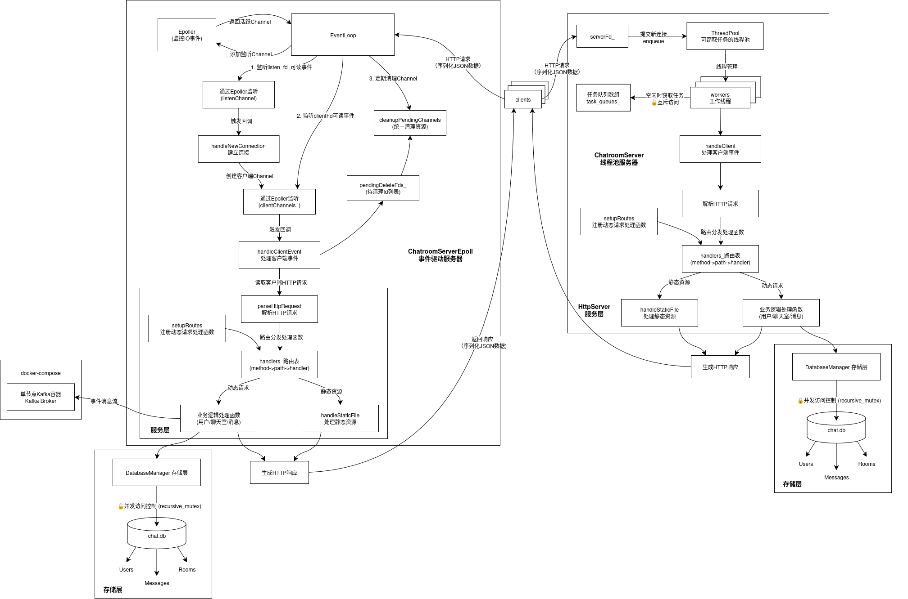

一个经典的 C++ 网络编程项目，使用了多线程和异步 IO 技术。适合学习网络编程和并发编程的同学。

---

## 目录

- [目录](#目录)
- [1. 项目概述](#1-项目概述)
- [2. 前置知识](#2-前置知识)
  - [2.1 json 序列化与反序列化](#21-json-序列化与反序列化)
  - [2.2 SQLite 数据库](#22-sqlite-数据库)
  - [2.3 librdkafka 消息队列](#23-librdkafka-消息队列)
  - [2.4 GTest, GFlags 和 GLog](#24-gtest-gflags-和-glog)
- [3. 项目结构](#3-项目结构)
  - [3.1 线程池并行处理请求模型](#31-线程池并行处理请求模型)
    - [3.1.1 线程池设计](#311-线程池设计)
    - [3.2 单 Reactor 模型](#32-单-reactor-模型)

---

## 1. 项目概述

在学习完 C++、操作系统、计算机网络后，自然而然想要用 Webserver 项目实践所学知识。我基于 ubuntu 24.04 LTS 系统，使用 CMake 构建项目，目标是实现一个支持多人聊天的服务器项目（ChatroomServer）。该项目具有：

- 并发处理任务（客户端访问、注册、登陆、聊天等）
- 持久化数据存储（用户信息、聊天记录等）
- 异步消息处理与分析（使用消息队列中间件）
- 平台可移植性（支持 Linux 和 Windows 系统）
- 负载均衡（通过 Nginx 反向代理实现）

为了实现以上功能，我们首先要明确涉及到的三方库：

- Threads: 必不可少的多线程库，处理并发请求。
- nlohmann/json: 解析和序列化数据（HTTP 请求和响应的传输格式，也可以用 protobuf）。
- SQLite: 轻量级数据库，可以将用户信息、聊天记录持久化存储在本地。
- librdkafka: 用于处理消息队列，支持异步消息传递。

除此以外考虑到测试和调试的便利性，我们需要引入 GTest, GFlags 和 GLog 三个库：

- GTest: Google 的 C++ 测试框架，用于编写单元测试。
- GFlags: Google 的命令行参数解析库，用于处理命令行参数。
- GLog: Google 的日志库，用于记录运行时日志。

> 为了进一步学习线程安全的单例模式，我们采用自己设计的 Logger 类来替代 GLog。
> 并且出于平台可移植性考虑，我们将上述三方库的源代码直接放在项目中，避免依赖系统安装的版本。

---

## 2. 前置知识

### 2.1 json 序列化与反序列化

|              | XML      | JSON    | Protobuf   |
| ------------ | -------- | ------- | ---------- |
| 传输格式     | 文本     | 文本    | 二进制     |
| 可读性       | 高       | 高      | 低         |
| 序列化速度   | 慢       | 快      | 非常快     |
| 反序列化速度 | 慢       | 快      | 非常快     |
| 数据大小     | 大       | 小      | 非常小     |
| 适用场景     | 配置文件 | Web API | 高性能服务 |

> JSON 只使用键值对和数组，而 XML 则需要更多的标签和属性来描述数据结构。
> 而 Protobuf 更加轻量化，因为它在序列化时省略了字段名，直接使用字段的索引进行编码。
> JSON 和 Protobuf 都有成熟的库支持。

```cpp
// nlohmann/json 库的使用示例
#include <nlohmann/json.hpp>

using json = nlohmann::json;

int main() {
    // 创建一个 JSON 对象
    json j;
    j["name"] = "Alice";
    j["age"] = 30;
    j["is_student"] = false;

    // 序列化 JSON 对象
    std::string serialized = j.dump();
    std::cout << "Serialized JSON: " << serialized << std::endl;

    // 反序列化 JSON 字符串为 JSON 对象
    json j2 = json::parse(serialized);
    std::cout << "Name: " << j2["name"] << std::endl;
    std::cout << "Age: " << j2["age"] << std::endl;
    std::cout << "Is Student: " << j2["is_student"] << std::endl;

    return 0;
}
```

### 2.2 SQLite 数据库

有许多数据库支持持久化存储数据，如 MySQL, Redis 等，SQLite 是其中一个轻量级的关系型数据库。

|          | SQLite     | MySQL    | Redis  |
| -------- | ---------- | -------- | ------ |
| 类型     | 关系型     | 关系型   | 键值对 |
| 存储方式 | 文件       | 服务器   | 内存   |
| 数据模型 | 表         | 表       | 键值对 |
| 适用场景 | 嵌入式应用 | Web 应用 | 缓存   |

> 所谓关系型数据库指的是数据以**表格形式**存储，表与表之间可以通过外键关联。关系型数据库速度较慢，但数据一致性和完整性较高，通常用于需要复杂查询和事务处理的场景。而键值对数据库则是以**键值对形式**存储数据，速度较快，但数据一致性和完整性较低，通常用于缓存和简单数据存储。

```cpp
// SQLite 的使用示例
#include <sqlite3.h>

int main() {
    sqlite3 *db;
    char *err_msg = 0;

    // 打开数据库
    int rc = sqlite3_open("test.db", &db);
    if (rc != SQLITE_OK) {
        sqlite3_close(db);
        return 1;
    }

    // 创建表
    const char *sql = "CREATE TABLE IF NOT EXISTS Users (Id INTEGER PRIMARY KEY, Name TEXT, Age INTEGER)";
    rc = sqlite3_exec(db, sql, 0, 0, &err_msg);
    if (rc != SQLITE_OK) {
        sqlite3_free(err_msg);
        sqlite3_close(db);
        return 1;
    }

    // 插入数据
    sql = "INSERT INTO Users (Name, Age) VALUES ('Alice', 30)";
    rc = sqlite3_exec(db, sql, 0, 0, &err_msg);
    if (rc != SQLITE_OK) {
        sqlite3_free(err_msg);
        sqlite3_close(db);
        return 1;
    }

    // 查询数据
    sql = "SELECT * FROM Users";
    rc = sqlite3_exec(db, sql, 0, 0, &err_msg);
    if (rc != SQLITE_OK) {
        sqlite3_free(err_msg);
        sqlite3_close(db);
        return 1;
    }

    // 关闭数据库
    sqlite3_close(db);
    return 0;
}
```

### 2.3 librdkafka 消息队列

Kafka 是一个分布式消息队列系统，用作分布式系统中的消息传递和事件处理（消息队列中间件）。librdkafka 是 Kafka 的 C/C++ 客户端库，提供 API 来与 Kafka 集群交互。Kafka 集群一般使用 Zookeeper （协调中间件）进行管理和协调。

> 常用的中间件有：消息队列中间件（如 Kafka, RabbitMQ, ActiveMQ）、缓存中间件（如 Redis, Memcached）、搜索引擎中间件（如 Elasticsearch, Solr）、网关中间件（如 Nginx, Kong）、数据库中间件（如 MySQL Proxy, PgBouncer）、任务调度中间件（如 Celery, Quartz）、分布式协调中间件（如 Zookeeper, Etcd）。

```cpp
// librdkafka 的使用示例
#include <librdkafka/rdkafka.h>

int main() {
    rd_kafka_t *rk; // Kafka 客户端实例
    rd_kafka_conf_t *conf; // Kafka 配置

    // 创建 Kafka 配置
    conf = rd_kafka_conf_new();
    rd_kafka_conf_set(conf, "bootstrap.servers", "localhost:9092", NULL, 0);

    // 创建 Kafka 客户端实例
    rk = rd_kafka_new(RD_KAFKA_PRODUCER, conf, NULL, NULL);
    if (!rk) {
        fprintf(stderr, "Failed to create Kafka client\n");
        return 1;
    }

    // 发送消息
    const char *topic = "test_topic";
    const char *message = "Hello, Kafka!";
    rd_kafka_producev(rk,
                      RD_KAFKA_V_TOPIC(topic),
                      RD_KAFKA_V_MSGFLAGS(RD_KAFKA_MSG_F_COPY),
                      RD_KAFKA_V_VALUE(message, strlen(message)),
                      RD_KAFKA_V_END);

    // 等待所有消息发送完成
    rd_kafka_flush(rk, 10000);

    // 销毁 Kafka 客户端实例
    rd_kafka_destroy(rk);
    return 0;
}
```

为了方便测试，我们在本地 Docker 容器中运行 Kafka 和 Zookeeper。可以使用以下命令启动 Kafka 和 Zookeeper（Docker Hub 上有现成的镜像）：

```bash
# 启动 Zookeeper
docker run -d --name zookeeper -p 2181:2181 wurstmeister/zookeeper:3.4.6

# 启动 Kafka
docker run -d --name kafka -p 9092:9092 --link zookeeper:zookeeper wurstmeister/kafka:latest
# 创建 Kafka 主题
docker exec kafka kafka-topics.sh --create --topic test_topic --bootstrap-server localhost:9092 --partitions 1 --replication-factor 1
```

### 2.4 GTest, GFlags 和 GLog

GTest 是 Google 的 C++ 测试框架，GFlags 是 Google 的命令行参数解析库，GLog 是 Google 的日志库。它们可以帮助我们编写测试用例、解析命令行参数和记录日志。

```cpp
// GTest 的使用示例
// test_sample.cpp
#include <gtest/gtest.h>

TEST(SampleTest, BasicAssertions) { // 测试用例、测试的名称
    EXPECT_EQ(1, 1); // 检查两个值是否相等
    EXPECT_TRUE(true); // 检查条件是否为真
}

// main.cpp
#include <gtest/gtest.h>

int main(int argc, char **argv) {
    ::testing::InitGoogleTest(&argc, argv);
    return RUN_ALL_TESTS();
}

// CMakeLists.txt
cmake_minimum_required(VERSION 3.10)
project(MyProject)

# 添加 GTest
find_package(GTest REQUIRED)
include_directories(${GTEST_INCLUDE_DIRS})

# 添加可执行文件
add_executable(MyTests main.cpp test_sample.cpp)

# 链接 GTest
target_link_libraries(MyTests ${GTEST_LIBRARIES} pthread)
```

```cpp
// GFlags 的使用示例
#include <gflags/gflags.h>
#include <iostream>

DEFINE_string(name, "world", "The name to greet");
DEFINE_int32(age, 0, "The age of the person");

int main(int argc, char **argv) {
    gflags::ParseCommandLineFlags(&argc, &argv, true);
    std::cout << "Hello, " << FLAGS_name << "!" << std::endl;
    std::cout << "You are " << FLAGS_age << " years old." << std::endl;
    return 0;
}

// CMakeLists.txt
cmake_minimum_required(VERSION 3.10)
project(MyProject)

# 添加 GFlags
find_package(GFlags REQUIRED)
include_directories(${GFLAGS_INCLUDE_DIRS})

# 添加可执行文件
add_executable(MyExecutable main.cpp)

# 链接 GFlags
target_link_libraries(MyExecutable ${GFLAGS_LIBRARIES})

// sh
./MyExecutable --name Alice --age 30
```

```cpp
// GLog 的使用示例
#include <glog/logging.h>
#include <iostream>

int main(int argc, char **argv) {
    google::InitGoogleLogging(argv[0]);
    LOG(INFO) << "Hello, GLog!";
    google::ShutdownGoogleLogging();
    return 0;
}

// CMakeLists.txt
cmake_minimum_required(VERSION 3.10)
project(MyProject)

# 添加 GLog
find_package(GLog REQUIRED)
include_directories(${GLOG_INCLUDE_DIRS})

# 添加可执行文件
add_executable(MyExecutable main.cpp)

# 链接 GLog
target_link_libraries(MyExecutable ${GLOG_LIBRARIES})
```

---

## 3. 项目结构

下面我们介绍项目的架构设计。首先此项目是一个练手项目，我们采用了基于线程池并行处理请求的模式和基于多路复用 IO 的单 Reactor 模型（由 EventLoop 负责监听和分发事件（路由函数））。



### 3.1 线程池并行处理请求模型

在线程池模型中，主线程负责创建 socket 轮询监听端口（连接请求），线程池中的工作线程负责处理具体的请求，阻塞等待执行任务队列中的任务。解析请求->路由分发（method->path->handler）回调函数处理不同类型的请求，实现 RESTful API。

#### 3.1.1 线程池设计

> 独占指针、互斥锁、条件变量、生产者-消费者模型、线程池、任务队列、优雅关闭

线程池使用了生产者-消费者模型，主线程作为生产者，将请求任务放入任务队列中，工作线程作为消费者，从任务队列中取出任务并执行。工作线程与工作队列、队列的互斥锁和条件变量一一对应。各个线程优先取用自己队列的任务，在任务队列为空时尝试从其他线程的队列中窃取任务。

1. 任务队列设计

   使用双端队列（deque）实现任务队列（先入先处理），每个工作线程都有自己的任务队列（分别用数组存储工作线程和指向任务队列的独占指针）。各个任务队列使用各自的互斥锁保护，条件变量用于通知工作线程有新任务到来。（生产者-消费者模型）

   ```cpp
   struct TaskQueue {
       std::mutex mutex;
       std::condition_variable condition;
       std::deque<std::function<void()>> tasks;
   };
   ```

2. 任务窃取

   在线程池构造函数中创建工作线程，各个线程优先尝试取用自己队列的任务，如果任务队列为空，则尝试从其他线程的队列中窃取任务。通过 `has_task` 标志是否持有任务，完全没有任务时阻塞等待，直到条件变量被通知。

```cpp
ThreadPool::ThreadPool(size_t num_threads) {
  stop_.store(false);
  task_queues_.resize(num_threads);
  for (size_t i = 0; i < num_threads; ++i) {
    task_queues_[i] = std::make_unique<TaskQueue>();
  }

  for (size_t i = 0; i < num_threads; ++i) {
    workers_.emplace_back([this, i]() {
      while (!stop_.load()) {
        std::function<void()> task;
        bool has_task = false;
        {
          auto& task_queue = task_queues_[i];
          std::unique_lock<std::mutex> lock(task_queue->mutex);
          if (!task_queue->tasks.empty()) {
            task = std::move(task_queue->tasks.front());
            task_queue->tasks.pop_front();
            has_task = true;
          }
        }

        if (!has_task) {
          if (steal_task(i, task)) {
            has_task = true;
          } else {
            auto& task_queue = task_queues_[i];
            std::unique_lock<std::mutex> lock(task_queue->mutex);
            task_queue->condition.wait(lock, [this, &task_queue] {
              return stop_.load() || !task_queue->tasks.empty();
            });
            if (stop_.load() && task_queue->tasks.empty()) {
              return;
            }
            if (!task_queue->tasks.empty()) {
              task = std::move(task_queue->tasks.front());
              task_queue->tasks.pop_front();
              has_task = true;
            }
          }
        }

        if (has_task) {
          task();
        } else {
          std::this_thread::yield(); // 如果没有任务，线程让出 CPU 时间片
        }
      }
    });
  }
}
```

3. 任务提交

   提供 `enqueue` 方法将任务提交到线程池中。任务可以是任何可调用对象（如 lambda 函数、函数指针等）。通过 `invoke_result` 推断返回类型，使用完美转发和 `std::bind` 来创建异步任务（作为函数对象存储在任务队列中）。

```cpp
template <typename F, typename... Args>
auto ThreadPool::enqueue(F&& f, Args&&... args)
    -> std::future<typename std::invoke_result<F, Args...>::type> {
  using return_type = typename std::invoke_result<F, Args...>::type;
  auto task = std::make_shared<std::packaged_task<return_type()>>(
      std::bind(std::forward<F>(f), std::forward<Args>(args)...));
  std::future<return_type> result = task->get_future();

  size_t queue_index = queue_index_++ % workers_.size();
  {
    std::lock_guard<std::mutex> lock(task_queues_[queue_index]->mutex);
    task_queues_[queue_index]->tasks.emplace_back([task]() { (*task)(); });
  }
  task_queues_[queue_index]->condition.notify_one();
  return result;
}
```

4. 优雅关闭

   提供 `stop` 方法来优雅地关闭线程池，等待所有任务完成后再退出。通过设置 `stop_` 标志位和通知所有工作线程来实现。

```cpp
ThreadPool::~ThreadPool() {
  stop_.store(true);
  for (auto& task_queue : task_queues_) {
    task_queue->condition.notify_all();
  }
  for (auto& worker : workers_) {
    if (worker.joinable()) {
      worker.join();
    }
  }
}
```

#### 3.2 单 Reactor 模型

1. Reactor 模型

   Reactor 模型是事件驱动的网络编程模型，使用单线程或多线程来处理事件。单 Reactor 模型中，通过主线程事件循环 EventLoop 监听和分发事件，处理不同类型的 IO 事件（如连接请求、读写事件等）。每个事件类型对应一个处理函数（回调函数），通过注册回调函数来处理不同的事件。

2. EventLoop, Channel 和 Epoller 设计

   - EventLoop：事件循环，负责监听和分发事件。
   - Channel：表示一个 IO 通道，封装了文件描述符、关注事件、发生事件、回调函数。提供注册、注销和修改事件的接口。
   - Epoller：同时监听多个文件描述符的事件，通过 epoll 使用系统线程轮询监听 IO 事件。事件发生时唤醒 EventLoop（阻塞等待中），调用对应的回调函数处理事件。

```cpp
void EventLoop::loop() {
  running_ = true;
  std::vector<epoll_event> activeEvents;
  while (running_) {
    activeEvents.clear();
    int n = epoller_.wait(activeEvents, 1000);  // 1秒超时
    for (int i = 0; i < n; ++i) {
      int fd = activeEvents[i].data.fd;
      auto it = channels_.find(fd);
      if (it != channels_.end()) {
        it->second->setRevents(activeEvents[i].events);
        it->second->handleEvent();
      }
    }
    if (chatroomServerEpoll_) {
      chatroomServerEpoll_->cleanupPendingChannels();
    }
  }
}
‵‵‵

3. Channel 的注册、更新和删除
   - 注册：将 Channel 添加到 EventLoop 中，并通过 Epoller 注册到系统事件监听中。
   - 更新：修改 Channel 的关注事件或回调函数，并更新 Epoller 中的事件监听。
   - 删除：从 EventLoop 中删除 Channel，并从 Epoller 中注销事件监听。

```cpp
void EventLoop::addChannel(std::shared_ptr<Channel> channel) {
  int fd = channel->getFd();
  channels_[fd] = channel;
  epoller_.addFd(fd, channel->getEvents());
}

void EventLoop::updateChannel(std::shared_ptr<Channel> channel) {
  int fd = channel->getFd();
  channels_[fd] = channel;
  epoller_.modFd(fd, channel->getEvents());
}

void EventLoop::removeChannel(int fd) {
  channels_.erase(fd);
  epoller_.delFd(fd);
}
```

4. 优雅关闭

   提供 `quit` 方法来优雅地关闭 EventLoop，设置 `running_` 标志位为 false，退出事件循环。可以在需要关闭时调用该方法。

```cpp
void EventLoop::quit() {
  running_ = false;
  for (const auto& pair : channels_) {
    int fd = pair.first;
    epoller_.delFd(fd);  // 清理所有通道
  }
  channels_.clear();
}
```
