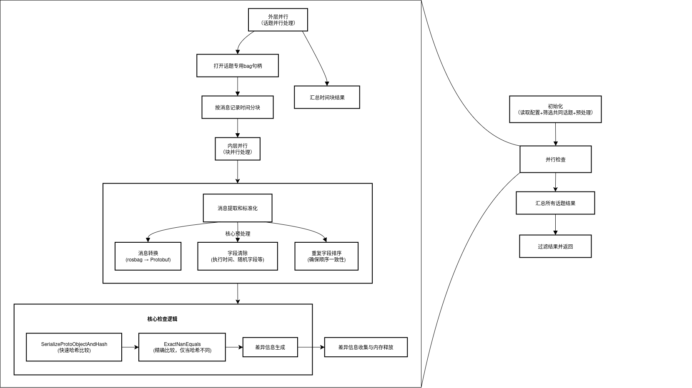

## 目录

- [目录](#目录)
- [1. 项目背景](#1-项目背景)
- [2. 前置知识](#2-前置知识)
  - [2.1 ROS（Robot Operating System）](#21-rosrobot-operating-system)
  - [2.2 Protobuf](#22-protobuf)
  - [2.3 TBB（Threading Building Blocks）](#23-tbbthreading-building-blocks)
  - [2.4 CI/CD（持续集成/持续部署）](#24-cicd持续集成持续部署)
- [3. 项目结构](#3-项目结构)
  - [3.1 主要工作一：复杂结构化消息快速预处理](#31-主要工作一复杂结构化消息快速预处理)
  - [3.2 主要工作二：多线程并发执行的快速确定性检查](#32-主要工作二多线程并发执行的快速确定性检查)
  - [3.3 主要工作三：基于 Airflow 的 CI/CD 流水线](#33-主要工作三基于-airflow-的-cicd-流水线)

---

## 1. 项目背景

确定性检查是自动驾驶仿真中确保输出一致性、仿真可复现性的关键环节。虽然仿真过程中存在大量随机因素（如外部扰动、传感器噪声、端到端算法中的黑盒模型等），但在仿真时只要确保仿真环境的输入一致且执行代码完全相同，输出就应该是确定的。为此，我们需要对仿真过程中的随机因素进行控制、记录和对比，确保排除算法自身的不确定因素（如浮点数求和不确定性、并发执行带来的顺序问题、编译优化级别差异等）。确定性检查通常通过比对两次运行产生的rosbag文件实现，**分析消息内容、时序和数据结构的差异**，从而验证系统行为一致性。

---

## 2. 前置知识

### 2.1 ROS（Robot Operating System）

本项目基于 ROS1 框架开发，ROS 是一个开源的机器人操作系统。其核心概念包括：节点（Node）、话题（Topic）、服务（Service）、消息（Message）。节点是 ROS 中的基本执行单元，话题用于节点间的异步通信，服务用于同步请求响应通信，消息是 ROS 中数据传输的基本格式。

ROS1 中依赖 master-slave 模型进行节点发现和通信，所有节点通过 ROS Master 进行注册和发现。在代码编写中，节点通过 `ros::init` 初始化，使用 `ros::NodeHandle` 进行节点间通信。比如通过 `ros::NodeHandle::advertise` 创建发布器，`ros::NodeHandle::subscribe` 创建订阅器。常见的操作有通过注册回调函数处理消息（可以实现异步处理），对于异步处理中的某些初始化操作，我们通常可以借助 C++11 的 `std::call_once` 确保只执行一次。最终使用 `ros::spin` 进入事件循环等待消息到来。

类似地，节点通过 `ros::NodeHandle::advertiseService` 创建服务器，使用 `ros::NodeHandle::serviceClient` 创建客户端。服务的回调函数通常是同步执行的，处理完请求后返回响应。

rosbag 是 ROS 提供的用于记录和回放话题消息的工具。我们可以通过对 `.bag` 中的消息进行比对，来验证两次仿真运行的输出一致性。常见指令有：

- `rosbag record xxx`：记录指定话题的消息到 bag 文件。
- `rosbag play xxx.bag`：回放 bag 文件中的消息到话题。
- `rosbag info xxx.bag`：查看 bag 文件的基本信息。

### 2.2 Protobuf

Protobuf（Protocol Buffers）是 Google 开发的一种语言中立、平台中立、可扩展的序列化结构数据的方法。Protobuf 预先定义消息格式（.proto 文件，通过编号定义字段），序列化时只存储字段编号和数据，传输效率更高。并且相比于文本格式的 JSON 和 XML（可读性更好），Protobuf 采用二进制格式存储数据，解析速度更快。

1. 定义消息格式：使用 `.proto` 文件定义消息结构。
   ```protobuf
   syntax = "proto3";
   message Example {
       int32 id = 1;
       string name = 2;
   }
   ```
2. 编译生成代码：使用 `protoc` 编译器将 `.proto` 文件编译为 C++、Python 等语言的代码。
   ```bash
   protoc --cpp_out=. example.proto
   ```
3. 使用生成的代码进行序列化和反序列化。
   ```cpp
   #include "example.pb.h"

   Example example;
   example.set_id(1);
   example.set_name("Test");

   // 序列化
   std::string output;
   example.SerializeToString(&output);

   // 反序列化
   Example new_example;
   new_example.ParseFromString(output);
   ```
4. 静态编译的 Protobuf 消息可以通过生成的类直接访问已知字段，但在需要运行时动态处理字段时，
    描述符（Descriptor）提供了消息的结构信息，反射机制允许我们在运行时动态访问和修改消息字段。
   ```cpp
    const google::protobuf::Descriptor* descriptor = example.GetDescriptor();
    const google::protobuf::Reflection* reflection = example.GetReflection();
    const google::protobuf::FieldDescriptor* field = descriptor->FindFieldByName("name");
    if (field) {
        std::string name = reflection->GetString(example, field);
        std::cout << "Name: " << name << std::endl;
        reflection->SetString(&example, field, "New Name");
    }
   ```

### 2.3 TBB（Threading Building Blocks）

TBB 是 Intel 开发的 C++ 并行编程库。


1. 任务执行环境：控制任务的执行上下文，包括线程亲和性、内存分配等。既可以通过并行算法实现，也可以通过任务组进行管理。

    ```cpp
    #include <tbb/task_arena.h>

    tbb::task_arena arena(4); // 创建一个包含4个线程的任务执行环境
    arena.execute([] {
    // 直接执行一个任务
        task(); // task 是任意可调用对象
    });

    arena.execute([] {
        // 并行执行任务组
        tbb::task_group tg;
        for (int i = 0; i < 4; ++i) {
            tg.run(task); // 并行执行4个sleep任务
        }
        tg.wait();
    });

    arena.execute([&] {
        // 并行算法
        tbb::parallel_for(0, 100, [](int i) {
            // 在 arena 内并行执行的任务
        });
    });
    ```

2. 并行算法：如 `parallel_for`、`parallel_reduce` 等，用户可以通过这些算法轻松实现任务并行化。

    ```cpp
    #include <tbb/parallel_for.h>
    tbb::parallel_for(0, 100, [](int i) {
        // 并行执行的任务
    });
    ```

3. 并行容器：如 `concurrent_vector`、`concurrent_hash_map` 等，用户可以在多线程环境下安全地使用这些容器（自带同步原语）。

    ```cpp
    #include <tbb/concurrent_vector.h>
    tbb::concurrent_vector<int> vec;
    vec.push_back(1); // 多线程安全地添加元素
    ```

4. 任务组：虽然 TBB 可以直接管理任务的执行，任务组提供了一种更高层次的抽象，允许用户将多个任务组织在一起并管理依赖关系。

    ```cpp
    #include <tbb/task_group.h>
    tbb::task_group tg;
    tg.run([] { /* 任务A */ });
    tg.run([] { /* 任务B */ });
    tg.wait(); // 等待所有任务完成
    ```

### 2.4 CI/CD（持续集成/持续部署）

CI/CD 是一种软件开发实践。CI（持续集成）强调频繁地将代码集成到主干分支，并通过自动化测试验证代码的正确性；CD（持续部署）则在 CI 的基础上，自动将通过测试的代码部署到生产环境。

比如 Github Actions 提供了强大的 CI/CD 功能，可以通过编写工作流文件（`.github/workflows/ci.yml`）定义自动化流程。工作流可以触发在代码提交、拉取请求等事件上执行，支持多种操作，如编译、测试、部署等。

---

## 3. 项目结构



### 3.1 主要工作一：复杂结构化消息快速预处理

通过 Protobuf 的序列化和反射机制，实现对 RosBag 消息的快速预筛选。主要步骤包括：

1. 预排序处理：自动驾驶中的并行算法常产生内容相同但顺序不同的消息字段（repeat 字段）
   - 按照字段路径对复合消息进行 BFS 递归遍历，对中间节点的 repeat 字段排序

2. 预筛选处理：由于代码插桩或其他原因，会产生一些无关消息字段（如时间戳、ID 等）
   - 通过 Protobuf 的反射机制，进行 DFS 递归遍历清除无关字段

### 3.2 主要工作二：多线程并发执行的快速确定性检查

1. 消息序列化后生成哈希值，通过哈希值快速对比消息内容是否一致

2. 对 RosBag 进行话题级并行确定性检查；对特定复合话题进行块级并行确定性检查（按字段分块）

### 3.3 主要工作三：基于 Airflow 的 CI/CD 流水线

1. 使用 Apache Airflow 实现自动化的 CI/CD 流水线，负责确定性检查任务的调度和执行。

2. 集成 Buildbot，实现对代码提交的自动化测试和持续集成。针对不同的算法模块配置不同的场景集。

3. 结合 Kafka 与 Hive 平台，实现数据的实时处理和存储。Kafka 用于消息传递，Hive 用于数据分析和查询。

