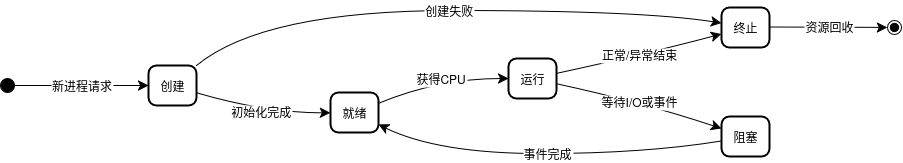
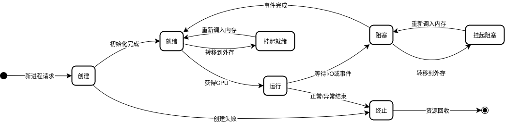
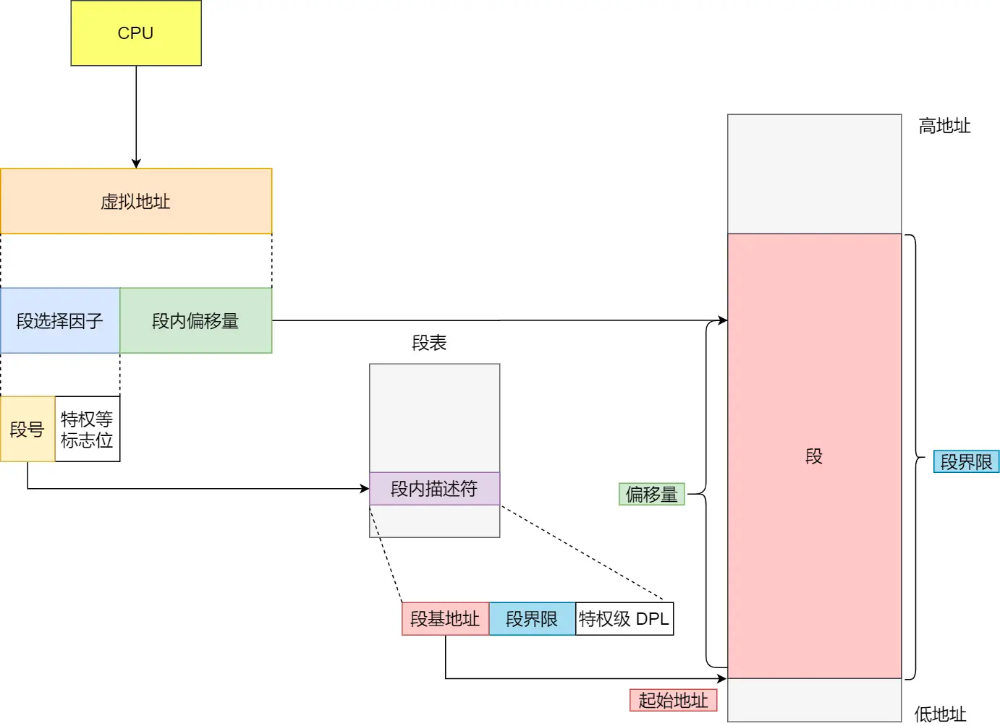
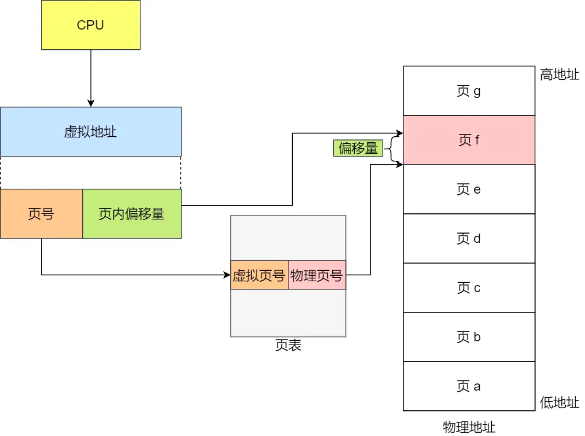
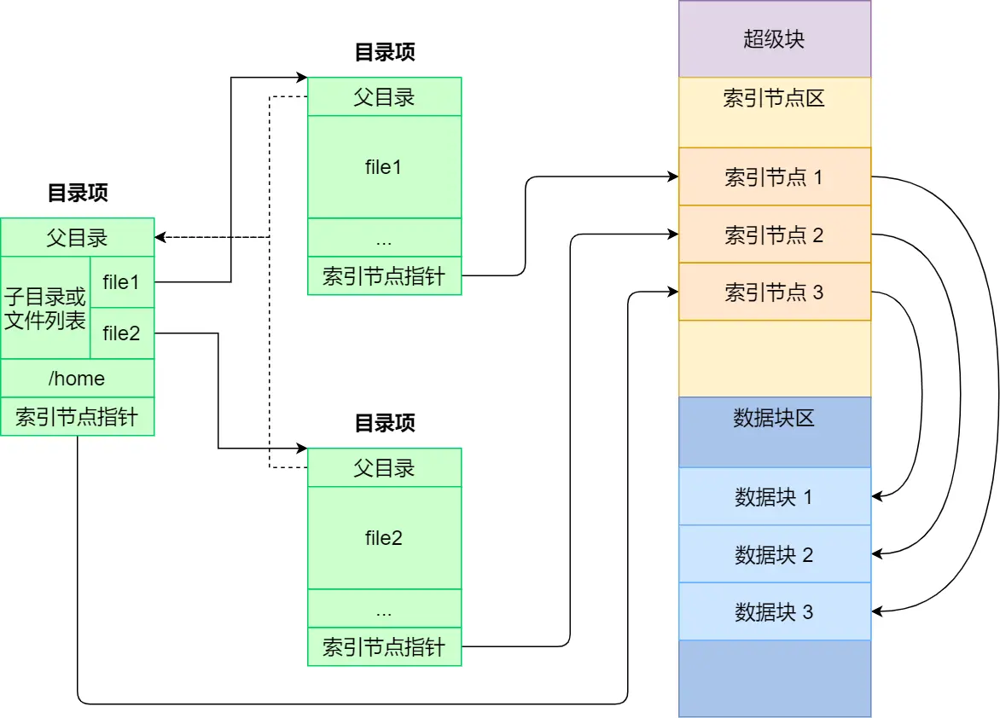
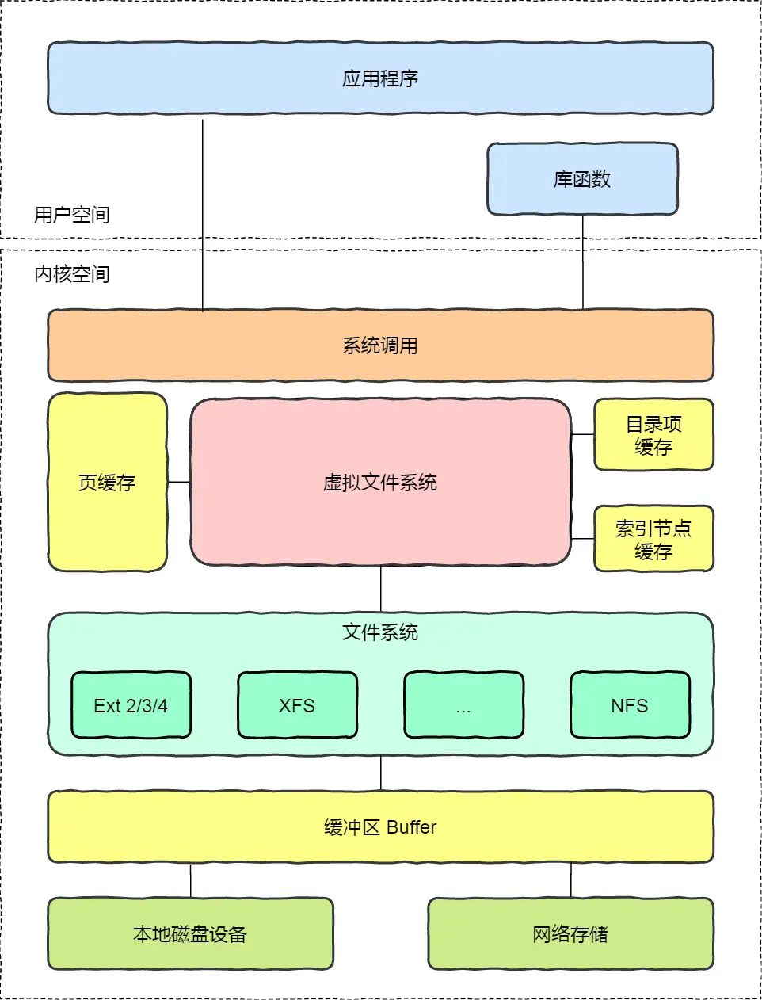
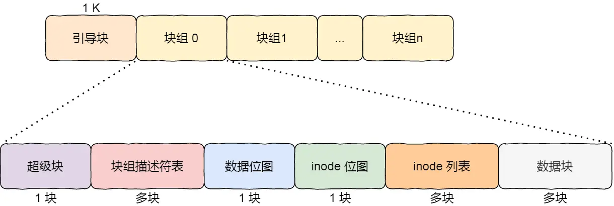
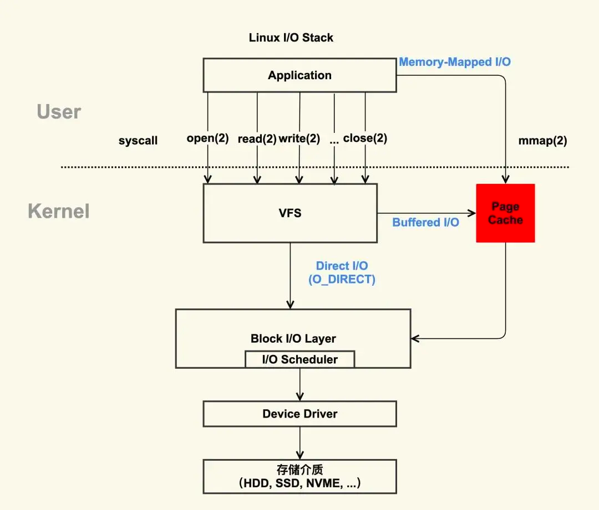

操作系统的知识可以分为五个部分：进程管理、内存管理、文件系统、设备管理、网络系统。这里的网络系统主要是操作系统如何处理网络通信。仅仅照着知识抄笔记是没有用的，重要的是通过理解结合实践来形成自己的知识体系，并且有能力表达出来。

# 1. 进程管理

## 1.1 进程
### 1.1.1 进程状态

进程 process 定义为正在执行的程序的实例。它是操作系统资源分配和调度的基本单位。一个完整的进程状态变迁包括：

为了避免阻塞状态的进程占据物理内存，虚拟内存技术允许操作系统将阻塞进程的数据存储在磁盘上，只有在需要时才加载到内存中。也因此需要一个中间状态描述进程没有占据物理内存的状态 —— 挂起状态。挂起状态可分为两种：挂起就绪（进程在外存，只要进入内存就执行）和挂起阻塞（进程在外存等待）。

进程挂起的原因有：系统资源不足、进程主动挂起、操作系统调度策略、用户 Ctrl + C/Ctrl + Z 等。

### 1.1.2 进程控制

进程控制块（PCB）是操作系统用来管理进程的核心数据结构。它包含了进程的所有信息：
- 进程标识信息：如进程ID（pid）、用户ID（uid），用于唯一标识和归属进程。
- 进程状态信息：记录进程当前所处的状态（如新建、就绪、运行、阻塞、挂起等）。
- 优先级和调度信息：进程的优先级、调度相关参数，决定进程获得CPU的顺序。
- 资源分配信息：进程所占用的内存空间、打开的文件列表、使用的I/O设备等资源清单。
- CPU相关信息：如寄存器内容、程序计数器（PC）、堆栈指针等，用于进程切换时保存和恢复运行环境。
- 进程间关系信息：如父进程、子进程等层级关系。

将具有相同状态的进程的 PCB 链在一起，组成各种队列：就绪队列、阻塞队列、挂起就绪队列、挂起阻塞队列等。CPU 的核心（执行硬件单元）通过调度算法从就绪队列中选择一个进程执行。调度算法可以是先来先服务（FCFS）、短作业优先（SJF）、轮转（RR）等。

进程控制指的是操作系统对进程的创建、终止、阻塞、唤醒等操作。进程的创建通常由系统调用 `fork()` 实现，它会复制当前进程的 PCB，分配资源后插入就绪队列。新创建的进程会获得一个新的进程ID（pid），并且其父进程ID（ppid）指向原进程。终止进程则通过 `exit()` 系统调用完成，操作系统会清理该进程的资源并更新相关队列。阻塞进程通常是因为等待某些事件（如I/O操作完成），进程也可以主动调用 `sleep()` 等函数进入阻塞状态。一旦进程被阻塞只能等待事件的发生或由其他进程唤醒。

### 1.1.3 进程的上下文切换

操作系统在多任务环境下，保存当前进程的状态信息（上下文）在 PCB 中，并从另一个进程的 PCB 中加载状态信息。进程的状态信息（上下文）包括：用户空间的虚拟内存、全局变量、栈，还包括内核空间的内核堆栈、寄存器内容等。上下文切换一般发生在：进程时间片用完、进程阻塞等待I/O、进程主动让出CPU等。

## 1.2 线程

线程是相对于进程更小的，独立运行的基本执行单位。线程既可以并发运行（具有自己的寄存器状态和栈），同时又共享进程的资源（如内存空间、文件描述符等）。线程的创建和管理比进程更轻量级，因为线程之间的切换不需要像进程那样保存和恢复完整的上下文。对于统一进程内的线程，切换时只需切换不共享的数据（私有数据、寄存器）即可。线程的缺点是，当一个线程崩溃时，整个进程都会受到影响，因为它们共享同一地址空间。

总结性地说，线程是进程中的一条执行流程。两者相比，线程的创建和销毁开销更小，切换速度更快，但线程之间的共享资源也带来了更多的同步和安全问题。

目前主要有三种线程模型：用户级线程（User-Level Threads, ULT）、内核级线程（Kernel-Level Threads, KLT）和轻量级进程（Lightweight Process, LWP）。用户级线程由用户空间的库管理，内核不感知线程的存在；内核级线程由操作系统内核直接管理，内核可以调度和管理每个线程；轻量级进程则是介于两者之间的模型，允许多个用户级线程映射到一个或多个内核级线程（多对一、一对一、多对多）。

操作系统不参与用户线程的调度和管理（直接调度进程），而是通过线程库（如 pthreads）来实现用户级线程的创建、同步和销毁。内核级线程则由操作系统内核直接调度，支持多核处理器的并行执行。

- 用户线程的优点
  - TCB 由用户空间的线程库函数管理，每个进程都需要维护自己的线程控制块（TCB），无需内核支持。
  - 线程之间的切换不需要进行用户态和内核态的切换，切换速度快。
- 用户线程的缺点
  - 内核无法感知用户线程的存在，无法进行调度和管理。
  - 在多线程运行时，每个线程分到的时间片相较于其他进程会更少，可能导致线程饥饿。
- 内核线程的优点
  - 内核可以感知线程的存在，能够进行调度和管理。
  - 支持多核处理器的并行执行，可以充分利用多核 CPU 的性能。
- 内核线程的缺点
  - 切换线程时需要进行用户态和内核态的切换，切换速度相对较慢。
  - 内核需要维护每个线程的 TCB，增加了内核的复杂性和开销。
- 轻量级进程 LWP 是内核支持的用户线程，与内核线程一一映射，由内核管理调度。
  - 一对一：每个用户线程对应一个内核线程，内核可以独立调度每个线程。
  - 多对一：多个用户线程对应一个内核线程，内核只调度这个内核线程。
  - 一对多：一个用户线程对应多个内核线程，内核可以同时调度这些内核线程。

## 1.3 调度

线程才是操作系统调度的基本单位。调度算法决定了哪个线程在何时获得 CPU 的使用权。在进程状态切换时会触发调度（操作系统需要考虑当前进程的状态和优先级）。根据硬件时钟中断时操作系统是否进行调度，可以将调度分为两种类型：
- 非抢占式调度：操作系统不会在进程运行时强制切换进程，只有在进程主动让出 CPU 或阻塞时才进行调度。
- 抢占式调度：操作系统可以在任何时候强制切换进程，通常是通过硬件时钟中断来实现。（开销较大）

调度算法应该考虑以下几个方面： CPU 利用率尽量高，系统吞吐量尽量高（短任务优先）、周转时间尽量短（运行时间、阻塞时间、等待时间），等待时间（就绪状态）尽量短，响应时间尽量短（交互式系统），公平性（每个进程都能获得 CPU 的使用权）。

常见的调度算法：
1. 先来先服务（FCFS）：按照进程到达的顺序进行调度，简单但可能导致长作业阻塞短作业。
2. 短作业优先（SJF）：优先调度运行时间短的进程，平均等待时间最短，但可能导致长作业饥饿。
3. 时间片轮转（RR）：每个进程分配一个时间片，时间片用完后强制切换到下一个进程，适合交互式系统。
4. 优先级调度：根据进程的优先级进行调度，高优先级进程优先获得 CPU 使用权。
5. 多级反馈队列（MLFQ）：将进程分为多个优先级队列，允许进程在不同队列间动态调整。

# 2. 内存管理

单片机的 CPU 直接操作物理内存，所以单片机无法并发运行多个程序（不同程序的代码和数据无法同时存放在物理内存中）。操作系统通过虚拟内存技术为每个进程分配了独立的一套虚拟地址空间。每个进程只能访问自己的虚拟地址空间，操作系统通过页表将虚拟地址映射到物理地址。

## 2.1 虚拟内存映射
### 2.1.1 分段

程序由若干逻辑分段组成（代码段、数据段、堆栈段），每个分段有一个起始地址和长度。在分段机制下虚拟内存地址由两部分组成：段选择因子和段内偏移量。段选择因子用于查找段表（每个段都有一个段表项，从中获取段基地址）；段内偏移量用于计算物理地址。分段的优点是可以根据程序的逻辑结构进行内存分配，缺点是可能导致内存碎片，主要是外部碎片（分段的大小不一，可能导致无法利用的空闲内存），其次内存交换的效率较低。

### 2.1.2 分页

分页是将虚拟内存划分为固定大小的页（Page），将物理内存划分为同样大小的页框（Page Frame），通过页表（Page Table）实现虚拟地址到物理地址的映射。分页的优点是消除了外存碎片（因为页与页之间紧密排列），并且可以更高效地利用内存。分页的缺点是可能导致内部碎片（页内未使用的空间），以及页表的开销（页表存储于内存中，可能需要多级页表来减少内存开销）。

操作系统可以在程序暂时不使用时将其页交换到磁盘上（Swap out），当程序需要访问这些页时再将其交换回内存（Swap in）。一次性写入磁盘的只有少数页，所以页交换的效率较高。分页机制还可以实现虚拟内存的共享（多个进程可以共享同一页），以及内存保护（每个进程只能访问自己的页）。

|分段|分页|
|---|---|
|||

分页将虚拟地址空间划分为固定大小的页，而不是根据程序逻辑划分为不同大小的段。本质相当于牺牲页内的空间来换取页间的紧凑性。但是，分页需要通过页表项来映射虚拟地址和物理地址，页表项的大小通常为4KB或8KB，内存开销与虚拟地址空间的大小成正比。为了减少页表的大小，操作系统可以使用多级页表（如二级页表、三级页表等），上一级页表的每个条目指向下一页表，直到最后一级页表指向实际的物理页框。虽然引入了更多的页表，但通过**局部性原理**（只创建当前使用的页表项）可以有效减少内存开销。

多级页表虽然解决了单级页表的内存开销问题，但也引入了转换过程的开销。所以，CPU 中引入了**页表缓存（TLB, Translation Lookaside Buffer）**，它是一个小型的高速缓存 Cache，用于存储最近使用的页表项。TLB 的命中率越高，虚拟地址到物理地址的转换速度就越快。

### 2.1.3 段页式管理

段页式管理结合了分段和分页的优点，先将虚拟地址空间划分为逻辑段，每个段再划分为固定大小的页。这样可以在逻辑上保持程序的结构，同时又能利用分页的紧凑性和高效性。其物理转换需要经过三步：

1. 通过段选择因子找到段表，获取段基地址和段界限。
2. 通过段内偏移量找到页表，获取页框号（物理页号）。
3. 将页框号与段基地址（页内偏移量）相加，得到物理地址。

## 2.2 Linux 内存管理

Intel 早期的 x86 架构（如 80386）硬件支持分段机制，后来转向段页式管理。

Linux 操作系统在设计时，基本上不使用分段机制来做内存隔离和保护，而是让所有段的基地址都为 0，界限设置为最大，这样所有进程的“段”其实都覆盖了整个 4GB 虚拟地址空间。这样一来，段式映射形同虚设，虚拟地址直接等于线性地址，只有分页机制在真正发挥作用。

# 3. 文件系统

## 3.1 文件系统概述

文件系统负责将用户数据（unix 一切皆文件）存储在磁盘上，并提供对这些数据的访问和管理。Linux 文件系统为每个文件分配两个数据结构：索引节点（inode）和目录项（directory entry）。索引节点包含文件的元信息（如 inode 号、文件类型、大小、权限、位置、时间戳等），而目录项则是文件名与索引节点之间的映射关系（目录结构）。索引节点存储于磁盘上，而目录项存储于内存中（方便查询目录）。

磁盘的最小读写单位是扇区（sector），通常为 512 字节。Linux 中的逻辑块为 4KB（一次读写 8 个扇区）。文件系统将文件分割成多个逻辑块（block），文件系统通过块设备驱动程序与磁盘进行交互，块设备驱动程序负责将数据从内存读写到磁盘。

磁盘格式化时划分为三个区域：
1. **超级块（Superblock）**：包含文件系统的元信息，如文件系统类型、大小、块大小、空闲块数等。每个文件系统有一个超级块，存储在磁盘的固定位置。
2. **索引节点表（Inode Table）**：存储所有文件的索引节点，每个文件对应一个索引节点。索引节点表的大小取决于文件系统的设计和磁盘大小。
3. **数据块**（Data Block）：存储文件的实际数据内容。

超级块与索引节点存储于磁盘上，通常在需要使用时会将其加载到内存中。超级块在文件系统挂载时被读取并存储在内存中，以便快速访问。索引节点在文件打开时被加载到内存中，文件的读写操作通过索引节点进行。

|磁盘文件系统|Linux 文件系统架构|
|---|---|
|||

## 3.1 虚拟文件系统（VFS）

为了提供一个统一的文件访问接口，Linux 内核实现了虚拟文件系统（VFS）。VFS 允许不同类型的文件系统（如 ext4、xfs、nfs 等）通过统一的接口进行访问。VFS 定义了一组抽象的数据结构和函数，使得用户空间程序可以透明地访问不同类型的文件系统。**程序员了解 VFS 提供的接口即可**。

Linux 支持的文件系统可以分为三类：
1. 磁盘文件系统：如 ext4、xfs、btrfs 等，主要用于存储在磁盘上的文件。
2. 网络文件系统：如 NFS、CIFS 等，允许通过网络访问远程文件系统。
3. 内存文件系统：如 /tmp、/dev 等，存储在内存中的文件系统，通常用于临时文件和设备文件。

## 3.2 文件描述符

操作系统为每个进程维护一个文件描述符表（File Descriptor Table），每个文件描述符（FD）是一个整数索引，指向内核中的文件对象。文件描述符表内维护了：
- 文件对象指针：指向文件的索引节点（inode）。
- 当前偏移量：文件的读写位置。
- 文件打开计数器：记录文件被打开的次数，在计数为 0 时释放文件对象（删除文件描述符表项）。
- 访问权限：创建、只读、只写、添加等。

进程以字节读取文件，而操作系统以数据块（block）为单位进行读写。文件系统就是为了屏蔽掉这种读写差异：当进程读取数据时，文件系统会将数据从磁盘的逻辑块读取到内存中，并更新文件描述符表中的当前偏移量；当进程写入数据时，文件系统会将数据写入到磁盘的逻辑块，并更新文件描述符表中的当前偏移量。

## 3.3 文件存储

文件的数据存储在硬盘上，有连续存储和离散存储两种方式。
1. 连续存储：文件头要指定文件的起始位置和长度。优点是读写速度快，缺点是可能导致磁盘碎片（文件删除后留下空闲块）。
2. 离散存储又分为两种：
   - 链接存储：可以动态扩展文件长度，根据实现方式可分为显式链表（通过文件分配表FAT记录每个数据块指针）和隐式链表（每个数据块额外存储下一个数据块的指针）。相对于显式链表，隐式链表访问较慢（频繁访问磁盘）且稳定性较差（指针易丢失）。
   - 索引存储：文件头包含一个指针指向其索引节点（inode），索引节点中包含所有数据块的指针。类似 FAT 都是直接访问的方式。优点是访问速度快，缺点是索引节点大小有限制。
   - 链式 + 索引：当一个索引数据块的索引信息用完时通过指针找到下一个索引数据块，以支持更大的文件。
   - 多级索引：索引节点中存储指向其他索引节点的指针，形成多级索引结构。这样可以支持更大的文件，同时减少单个索引节点的大小限制。

Unix 综合了上述方式的优点（Ext 2/3）：
- 如果存放文件所需的数据块小于 10 块，则采用直接查找的方式；
- 如果存放文件所需的数据块超过 10 块，则采用一级间接索引方式；
- 如果前面两种方式都不够存放大文件，则采用二级间接索引方式；
- 如果二级间接索引也不够存放大文件，这采用三级间接索引方式；

## 3.4 磁盘空间管理

磁盘的空间管理有空间链表法（Free List）和位图法（Bitmap）两种方式。空间链表法使用链表来记录空闲块的地址，位图法使用一个位图来表示每个块的使用状态（0 表示空闲，1 表示已用）。位图法在内存中占用空间较小，且查找空闲块速度较快。
但仅仅使用一个块（4KB）来存储位图不够，最多只能表示 2^15 个块（4 * 1024 * 8）、即 128 MB 的磁盘空间。Linux 采用了多级位图（Multi-Level Bitmap）来表示更大的磁盘空间。每个位图块可以表示多个块的使用状态，形成多级结构。

Linux Ext2 文件系统结构如下：

首先是引导块，然后是一个个块组，每个块组包含一个超级块、一个块位图、一个索引节点位图和一个索引节点表。每个块组的大小可以是 1KB、2KB 或 4KB，具体取决于文件系统的设计。

在 Linux 中，目录也是一个文件，目录项（Directory Entry）存储在目录文件中。每个目录项包含文件名和对应的索引节点号（inode number）。目录文件的存储方式可以是线性存储（如 ext2 的目录项）、哈希存储（如 ext4 的目录项）。线性存储简单但查找效率低，哈希存储复杂但查找效率高。

## 3.5 符号链接和硬链接

Linux 中还可以使用符号链接（Symbolic Link）和硬链接（Hard Link）来实现文件的引用。
符号链接是一个特殊的文件，文件本身有独立的 inode ，内容是另一个文件的路径。硬链接是多个目录项中的索引节点指向同一个 inode，多个目录项可以共享同一个文件的内容。硬链接只能在同一文件系统内创建，并且删除时只有当所有硬链接都被删除后，文件内容才会被真正删除。符号链接可以跨文件系统，且不用担心文件内容被删除。

1. 缓冲与非缓冲 I / O

    - **缓冲 I/O**：通过标准库函数（如 `fopen()`、`fread()`、`fwrite()` 等）进行的 I/O 操作，这些函数会在内存中维护一个缓冲区，减少频繁系统调用的上下文切换开销。
    - **非缓冲 I/O**：直接通过系统调用（如 `open()`、`read()`、`write()`、`close()` 等）进行的 I/O 操作，性能较低但更接近底层操作。

    |Page Cache|
    |---|
    ||
2. 直接与非直接 I / O

    - **非直接 I/O**（默认）：通过页缓存进行读写，由内核决定何时将数据写入磁盘。常用函数有 `read()`、`write()`、`fread()`、`fwrite()` 等。
    - **直接 I/O**：数据直接从用户空间读写到磁盘，不经过页缓存。需要在 `open()` 时加上 `O_DIRECT` 标志，或使用 `posix_fadvise()`、`aio_read()`、`aio_write()` 等异步 I/O 接口。

3. 阻塞与非阻塞 I / O

    - **阻塞 I/O**：如 `read()`、`write()`、`accept()`、`recv()`、`send()` 等，默认情况下这些系统调用会阻塞线程直到数据准备好。
    - **非阻塞 I/O**：在 `open()` 或 `socket()` 后，通过 `fcntl()` 设置 `O_NONBLOCK` 标志，使 `read()`、`write()`、`accept()`、`recv()`、`send()` 等调用立即返回，不会阻塞线程。
    - **I/O 多路复用**：`select()`、`poll()`、`epoll_wait()` 等函数允许线程阻塞等待多个 I/O 事件。其中 `select` 和 `poll` 由内核遍历 fd 集合，`epoll` 则由内核维护事件表，用户注册感兴趣的事件，事件发生时内核返回就绪的 fd 列表。

4. 同步与异步 I / O

    - **同步 I/O**：如 `read()`、`write()`、`select()`、`poll()`、`epoll_wait()` 等，线程需要等待数据拷贝完成。
    - **异步 I/O**：如 `aio_read()`、`aio_write()`（POSIX AIO）、`io_submit()`、`io_getevents()`（Linux AIO）、`io_uring` 等，线程发起 I/O 请求后立即返回，内核完成数据拷贝后通过回调或事件通知应用程序。

