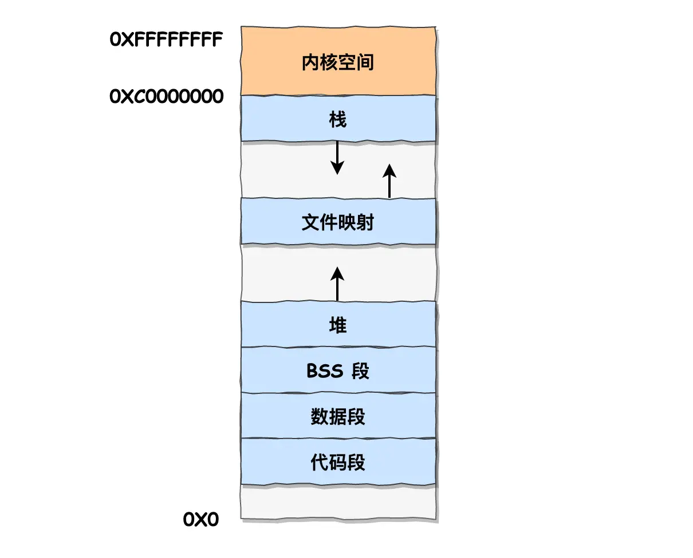

> 1945年，冯.诺依曼他们遵循图灵机的设计，进一步提出了“存储程序计算机”的概念。定义计算机基本结构为：存储器、运算器、控制器、输入设备和输出设备。这五个部分也被称为**冯.诺依曼模型**。

## 目录
- [目录](#目录)
- [1 进程管理](#1-进程管理)
  - [1.1 进程状态](#11-进程状态)
  - [1.2 进程控制与 CPU 上下文切换](#12-进程控制与-cpu-上下文切换)
  - [1.3 线程](#13-线程)
  - [1.4 进程间通信（IPC）](#14-进程间通信ipc)
  - [1.5 线程竞争与协作](#15-线程竞争与协作)
  - [1.6 经典同步问题](#16-经典同步问题)
  - [1.7 如何避免死锁](#17-如何避免死锁)
  - [1.8 系统线程上限](#18-系统线程上限)
- [2 调度算法](#2-调度算法)
  - [2.1 进程调度](#21-进程调度)
  - [2.2 内存置换](#22-内存置换)
  - [2.3 磁盘调度](#23-磁盘调度)
- [3. 内存管理](#3-内存管理)
  - [3.1 内存分段 + 内存分页](#31-内存分段--内存分页)
  - [3.2 Linux 内存管理](#32-linux-内存管理)
- [4. 文件系统](#4-文件系统)
  - [4.1 文件系统概述](#41-文件系统概述)
  - [4.2 文件的存储](#42-文件的存储)
  - [4.3 磁盘空间管理](#43-磁盘空间管理)
  - [4.4 符号链接和硬链接](#44-符号链接和硬链接)
  - [4.5 文件 I/O](#45-文件-io)

---

## 1 进程管理

### 1.1 进程状态

> **进程（process）定义为正在执行的程序的实例，是操作系统资源分配和调度的基本单位。线程（thread）是进程中的一个执行单元，是操作系统调度的基本单位。**

一个完整的进程状态变迁包括：创建、就绪、运行、阻塞、终止五个状态。为了避免处于阻塞状态的进程占据物理内存，虚拟内存技术允许操作系统将阻塞进程的数据存储在磁盘上，只有在需要时才加载到内存中。也因此需要一个中间状态描述进程没有占据物理内存的状态：**挂起状态**。挂起状态可分为两种：
- **挂起就绪**（进程在外存，只要进入内存就执行）
- **挂起阻塞**（进程在外存，并等待）
<p align="center">
  
</p>

<p align="center">
  
</p>

> **进程挂起的原因一般有**：系统资源不足、进程主动挂起、操作系统调度策略、用户 Ctrl + C/Ctrl + Z 等。


### 1.2 进程控制与 CPU 上下文切换

> **操作系统用进程控制块（PCB）来描述一个进程的状态和相关信息。PCB 包含：标识符（进程ID(pid)、用户ID（uid））、状态、优先级、资源分配、CPU寄存器内容等。**

操作系统通过 PCB 来跟踪进程的状态和资源分配。每个进程都有一个唯一的 PCB，通常存储在内核空间的链表中。比如就绪队列、阻塞队列等。除了链表方式，还有如索引方式（哈希表）等。

- 进程的**创建**、**终止**、**阻塞**、**唤醒**过程对应的系统调用如下：
  - 创建：`fork()`复制进程，`exec()`加载新程序，`clone()`Linux 下更细粒度的创建进程
  - 终止：`exit()`进程主动退出，`_exit()`底层退出，`kill()`向进程发送终止信号
  - 阻塞：`sleep()`主动休眠，`wait()`等待子进程，`read()/write()`阻塞IO，`pause()`等待信号

进程之间共享 CPU 资源，在不同进程之间需要进行**上下文切换**。进程的上下文（context）是指进程在 CPU 上执行时的状态信息，包括CPU 寄存器、程序计数器（PC）、堆栈指针等。为了让任务看起来连续，CPU 上下文切换可以看作三种：进程上下文切换、线程上下文切换和中断上下文切换。

1. **进程上下文切换**：操作系统的时间片轮转或进程阻塞（资源不足或主动等待）时，保存当前进程的上下文信息到 PCB 中，并从另一个进程的 PCB 中加载上下文信息。
2. **线程上下文切换**：线程共享进程的资源（比如虚拟内存、全局变量等），所以线程切换时只需要保存和恢复线程的寄存器状态和栈信息，开销更小。适用于需要多线程高并发执行的场景。
3. **中断上下文切换**：当外部中断发生时，操作系统需要保存当前进程的上下文信息，并加载中断处理程序的上下文信息。中断上下文切换通常比进程和线程上下文切换更快，因为它只涉及少量寄存器的保存和恢复。

### 1.3 线程

操作系统中主要有两种线程模型：用户级线程（ULT）和内核级线程（KLT）。用户级线程由用户空间的库管理，内核不感知线程的存在；内核级线程由操作系统内核直接管理，内核可以调度和管理每个内核级线程。除此还有一种轻量级进程（LWP），介于两者之间，允许多个用户级线程映射到一个或多个内核级线程（多对一、一对一、多对多）。

1. **用户级线程（ULT）**：由用户空间的库管理（多对一模型）。优点是切换快，无需内核支持，缺点是内核无法调度，易饥饿死锁。
    ```cpp
    #include <pth.h>
    pth_init();
    pth_t t = pth_spawn(PTH_ATTR_DEFAULT, thread_func, NULL);
    pth_join(t, NULL);
    pth_exit(0);
    ```
2. **内核级线程（KLT）**：TCB 放在内核中，内核可以调度和管理每个线程（一对一模型）。优点是内核可调度，但缺点是切换慢，内核开销大。内核级线程的创建和管理通常使用 POSIX 线程库（pthread）。
    ```cpp
    #include <threads.h>
    thrd_t t;
    thrd_create(&t, thread_func, NULL);
    thrd_join(t, NULL);
    thrd_exit(0);
    ```
    
3. **轻量级进程（LWP）**：介于两者之间，允许多个用户级线程映射到一个或多个内核级线程（多对一、一对一、多对多模型）。优点是结合两者优点，缺点是实现复杂。

### 1.4 进程间通信（IPC）

IPC 是指不同进程之间交换数据和信息的机制。常见的 Linux IPC 机制包括：
- **管道（Pipe）**：单向通信，数据从一个进程流向另一个进程（无格式的字节流）。
  - 匿名管道：通过系统调用 `pipe(int fd[2])` 创建。父子进程读写同一管道实现进程通信。
  - 命名管道：使用 `mkfifo` 创建，进程通过文件（管道也是种文件）进行通信。
- **消息队列（Message Queue）**：存储在内核中的消息链表，通过 `msgsnd()` 和 `msgrcv()` 收发消息。
  - 消息体（数据块）的格式预先定义、大小固定、且存在用户态和内核态之间的拷贝开销。
- **共享内存（Shared Memory）**：虚拟内存映射到同一个物理内存区域，直接访问速度快，但需要同步机制。
- **信号量（Semaphore）**：整数计数器，用于控制对共享资源的访问。通过 `sem_wait()` 和 `sem_post()` 操作。
- **信号 (Signal)**：通过信号来通知异常状态下的进程，可以通过 `kill -l` 查看信号列表。
  - 常用信号有 `SIGINT`（Ctrl+C）、`SIGTSTP`（Ctrl+Z）、`SIGKILL`（Ctrl+\）等。
  - 进程对信号可以默认操作、忽略信号或自定义信号处理函数（`signal()` 或 `sigaction()` 设置）。
- **套接字（Socket）**：用于网络通信的 IPC，支持 TCP/IP 协议族。
  - 流式套接字（TCP）提供可靠的连接，数据报套接字（UDP）提供无连接的快速通信。
  - 通过 `socket(int domain, int type, int protocol)` 创建套接字
  - `bind()` 绑定地址，`listen()` 监听，`accept()` 接受，`send()` 和 `recv()` 收发数据。


### 1.5 线程竞争与协作

**线程竞争**指的是多个线程同时访问共享资源（如全局变量、文件等）时可能导致数据不一致或死锁等问题。而**同步**则是指通过某种机制来协调线程之间的访问顺序，确保数据一致性和线程安全。

- 操作系统提供的进程/线程同步机制主要有两种：锁和信号量。

1. **锁（Mutex）**：根据锁的实现原理分为自旋锁（Spinlock）和互斥锁（Mutex）。

   - 自旋锁在等待时会不断循环检查锁状态（测试并设置）。适用于短时间等待的场景。

        ```cpp
        pthread_spin_lock(&spin);   // 加锁，自旋等待
        // 临界区
        pthread_spin_unlock(&spin); // 解锁
        ```

   - 互斥锁则会阻塞线程（放入阻塞队列），直到锁被释放。适用于长时间等待的场景。

        ```cpp
        pthread_mutex_lock(&mutex);   // 加锁，阻塞等待
        // 临界区
        pthread_mutex_unlock(&mutex); // 解锁
        ```

2. **信号量（Semaphore）**：通过原子操作 `sem_wait()` 和 `sem_post()` 来控制对共享资源的访问。

   - 将进入临界区的操作封装在信号量操作中并初始化信号量为 1，实现临界区的互斥访问。

        ```cpp
        sem_t mutex;        // 互斥信号量
        sem_init(&mutex, 0, 1);
        sem_wait(&mutex);   // P 操作，进入临界区
        // 临界区
        sem_post(&mutex);   // V 操作，离开临界区
        ```

### 1.6 经典同步问题

1. **生产者-消费者问题**：消费者从缓冲区取数据，缓冲区空时阻塞。生产者将数据放入缓冲区，缓冲区满时阻塞。
   1. **信号量**：使用两个信号量 `empty` 和 `full` 控制缓冲区的空和满状态。
        ```cpp
        sem_t empty;       // 空缓冲区信号量
        sem_t full;        // 满缓冲区信号量
        sem_init(&empty, 0, BUFFER_SIZE); // 初始化空缓冲区信号量
        sem_init(&full, 0, 0);            // 初始化满缓冲区信号量
        ```
   2. **互斥锁**：使用互斥锁确保只有一个生产者或消费者在操作缓冲区。
        ```cpp
        pthread_mutex_t mutex;
        pthread_mutex_init(&mutex, NULL);
        pthread_mutex_lock(&mutex);
        // 临界区
        pthread_mutex_unlock(&mutex);
        ```

2. **读者-写者问题**：多个读者可以同时读取数据，但写者需要独占访问数据。
   1. 读者优先：允许多个读者同时读取，但写者需要等待所有读者完成。

        ```cpp
        #include <pthread.h>
        #include <semaphore.h>

        sem_t read_count_mutex;  // 读者计数互斥锁
        sem_t resource_mutex;    // 资源互斥锁
        int read_count = 0;      // 当前读者数量

        void *reader(void *arg) {
            // 读者进入
            sem_wait(&read_count_mutex);
            read_count++;
            if (read_count == 1) {
                sem_wait(&resource_mutex);  // 第一个读者进入，锁住资源
            }
            sem_post(&read_count_mutex);

            // 读者临界区
            // 读取数据

            // 读者退出
            sem_wait(&read_count_mutex);
            read_count--;
            if (read_count == 0) {
                sem_post(&resource_mutex);  // 最后一个读者退出，释放资源
            }
            sem_post(&read_count_mutex);
        }
        void *writer(void *arg) {
            // 写者进入
            sem_wait(&resource_mutex);  // 独占资源

            // 写者临界区
            // 写入数据

            sem_post(&resource_mutex);  // 写者退出，释放资源
        }
        ```

   2. 写者优先：写者可以独占访问数据，读者需要等待写者完成。
        ```cpp
        void *writer(void *arg) {
            sem_wait(&resource_mutex);  // 独占资源

            // 写者临界区
            // 写入数据

            sem_post(&resource_mutex);  // 写者退出，释放资源
        }
        void *reader(void *arg) {
            sem_wait(&read_count_mutex);
            read_count++;
            if (read_count == 1) {
                sem_wait(&resource_mutex);  // 第一个读者进入，锁住资源
            }
            sem_post(&read_count_mutex);

            // 读者临界区
            // 读取数据

            sem_wait(&read_count_mutex);
            read_count--;
            if (read_count == 0) {
                sem_post(&resource_mutex);  // 最后一个读者退出，释放资源
            }
            sem_post(&read_count_mutex);
        }
        ```
   3. **公平读者-写者**：使用读者优先和写者优先的信号量，确保读者和写者公平访问资源。

        ```cpp
        #include <pthread.h>
        #include <semaphore.h>

        sem_t read_count_mutex;  // 读者计数互斥锁
        sem_t resource_mutex;    // 资源互斥锁
        int read_count = 0;      // 当前读者数量

        void *reader(void *arg) {
            // 读者进入
            sem_wait(&read_count_mutex);
            read_count++;
            if (read_count == 1) {
                sem_wait(&resource_mutex);  // 第一个读者进入，锁住资源
            }
            sem_post(&read_count_mutex);

            // 读者临界区
            // 读取数据

            // 读者退出
            sem_wait(&read_count_mutex);
            read_count--;
            if (read_count == 0) {
                sem_post(&resource_mutex);  // 最后一个读者退出，释放资源
            }
            sem_post(&read_count_mutex);
        }

        void *writer(void *arg) {
            // 写者进入
            sem_wait(&resource_mutex);  // 独占资源

            // 写者临界区
            // 写入数据

            sem_post(&resource_mutex);  // 写者退出，释放资源
        }
        ```

3. **哲学家就餐问题**：每人有一个叉子，只有拿到两个叉子才能吃饭。需要避免死锁和饥饿。
   - 方案一：用同步信号量（初始化为0）确保每个哲学家只能拿到两个叉子。（存在死锁风险）
        ```cpp
        sem_t forks[5];  // 5个叉子

        void *philosopher(void *arg) {
            int id = *(int *)arg;
            while (1) {
                // 思考
                sem_wait(&forks[id]);          // 拿左边的叉子
                sem_wait(&forks[(id + 1) % 5]); // 拿右边的叉子
                // 吃饭
                sem_post(&forks[id]);          // 放下左边的叉子
                sem_post(&forks[(id + 1) % 5]); // 放下右边的叉子
            }
        }
        ```
   - 方案二：用同步信号量（0）+互斥信号量（1）确保每次只有一个哲学家拿叉子。
        ```cpp
        sem_t forks[5];  // 5个叉子
        sem_t mutex;     // 互斥信号量

        void *philosopher(void *arg) {
            int id = *(int *)arg;
            while (1) {
                // 思考
                sem_wait(&mutex);              // 进入临界区
                sem_wait(&forks[id]);          // 拿左边的叉子
                sem_wait(&forks[(id + 1) % 5]); // 拿右边的叉子
                sem_post(&mutex);              // 离开临界区
                // 吃饭
                sem_post(&forks[id]);          // 放下左边的叉子
                sem_post(&forks[(id + 1) % 5]); // 放下右边的叉子
            }
        }
        ```
   - 方案三：采用分支结构避免所有哲学家同时取左手的叉子。
        ```cpp
        sem_t forks[5];  // 5个叉子

        void *philosopher(void *arg) {
            int id = *(int *)arg;
            while (1) {
                // 思考
                if (id % 2 == 0) { // 偶数哲学家先拿左手叉子
                    sem_wait(&forks[id]);
                    sem_wait(&forks[(id + 1) % 5]);
                } else { // 奇数哲学家先拿右手叉子
                    sem_wait(&forks[(id + 1) % 5]);
                    sem_wait(&forks[id]);
                }
                // 吃饭
                sem_post(&forks[id]);
                sem_post(&forks[(id + 1) % 5]);
            }
        }
        ```
   - 方案四：仅当左右哲学家都不在用叉子时，才能尝试拿起叉子。

        ```cpp
        sem_t forks[5];  // 5个叉子
        int state[5]; // 哲学家状态：0-思考，1-吃饭

        void *philosopher(void *arg) {
            int id = *(int *)arg;
            while (1) {
                // 思考
                sem_wait(&forks[id]);          // 拿左边的叉子
                sem_wait(&forks[(id + 1) % 5]); // 拿右边的叉子

                // 检查左右哲学家状态
                if (state[id] == 0 && state[(id + 1) % 5] == 0) {
                    state[id] = 1; // 吃饭
                    // 吃饭
                } else {
                    sem_post(&forks[id]);          // 放下左边的叉子
                    sem_post(&forks[(id + 1) % 5]); // 放下右边的叉子
                }
            }
        }
        ```

### 1.7 如何避免死锁

> 死锁只有在满足：1、**互斥条件**（资源不能共享）；2、**请求和保持条件**（进程持有资源并请求其他资源）；3、**不可剥夺条件**（资源不能被强制释放）；4、**循环等待条件**（进程形成循环等待）时才会发生。

为避免死锁，可以采取以下策略：

1. 资源有序分配：进程按照固定顺序请求资源（如按编号顺序），避免循环等待。

2. 资源预分配：进程在运行前一次性申请所需的所有资源，避免请求和保持条件。

3. 资源剥夺：当进程请求资源时，如果资源不可用，可以强制剥夺其他进程的资源。

4. 死锁检测与恢复：定期检查系统状态，发现死锁后采取措施（如终止某些进程或回滚操作）来解除死锁。

### 1.8 系统线程上限

在 Linux 系统中虚拟地址空间分为用户空间和内核空间。每个进程的虚拟地址空间通常为 4GB（32 位系统），其中用户空间为 3GB，内核空间为 1GB。（64 位系统中，虚拟地址空间为 128TB（理论上）。每个进程可以创建的线程数量受限于系统资源和内核参数。）每个线程的栈大小通常为 8MB（可通过 `ulimit -s` 查看和设置）。

系统内的线程数量受限于以下几个因素：
1. **内核参数**：
   - `/proc/sys/kernel/threads-max`：系统允许的最大线程数。
   - `/proc/sys/kernel/pid_max`：系统允许的最大进程数。
   - `/proc/sys/vm/max_map_count`：每个进程的最大内存映射数（影响线程数量）。
2. **用户空间限制**：每个进程的用户空间大小限制了其可用的线程栈空间。
3. **系统资源**：如内存、CPU 等资源的可用性也会影响线程的创建。（可通过 `ulimit -a` 查看当前用户的资源限制（文件大小、文件数、栈大小、内存大小、进程数、CPU 时间等）。）

## 2 调度算法

操作系统有三大调度机制：进程调度、内存置换和磁盘调度。调度算法是操作系统核心部分，负责管理进程的执行顺序和资源分配。


### 2.1 进程调度

> 提高CPU利用率：当进程因I/O阻塞时，应及时调度其他就绪进程运行，避免CPU空闲。
>
> 提升系统吞吐量：合理安排长短任务，提高单位时间内完成的进程数量。
> 
> 缩短周转时间：减少进程从提交到完成的总时间，避免长时间等待。
> 
> 减少等待时间：让就绪队列中的进程尽快获得CPU，缩短等待。
> 
> 优化响应时间：优先保证交互式应用的快速响应，提升用户体验。

操作系统需要在进程状态变化时进行调度（就绪队列、阻塞队列）。调度算法可分为**非抢占式调度**和**抢占式调度**。

1. **非抢占式调度**：只在进程主动让出或阻塞时才进行调度。适用于实时系统和长时间运行的任务。
2. **抢占式调度**：可以强制切换进程，通常通过硬件时钟中断实现。适用于多任务和交互式系统。

| 调度算法 | 特点 |
|---|---|
| 先来先服务（FCFS） | 简单，但是长作业阻塞短作业 |
| 短作业优先（SJF） | 平均等待时间最短，但是长作业易饥饿 |
| 高响应比优先（HRRN） | 考虑等待时间，平衡短长作业 |
| 时间片轮转（RR） | 公平地分配 CPU 时间片，适合交互式系统 |
| 最高优先级调度（HPF） | 高优先级进程优先，可能导致低优先级饥饿 |
| 多级反馈队列（MLFQ） | 综合 RR 和 SJF 的优点，动态调整优先级 |

### 2.2 内存置换

当 CPU 访问的内存页不在物理内存中时，操作系统需要将某个页从磁盘加载到内存中（缺页中断）。内存已满时操作系统需要选择一个页进行置换（将其从内存中移除）。

页表项一般有：页号、物理页号、状态位（是否有效）、访问字段（访问次数）、修改位（是否写回）、硬盘地址（块号）。


|内存置换算法|特点|
|---|---|
| 最佳页面置换（OPT） | 理论最优，预测未来访问，但不可实现 |
| 先进先出（FIFO） | 最简单，按页进入内存的顺序置换，但可能导致 Belady 异常 |
| 最近最久使用（LRU） | 根据最近使用情况置换，性能较好，但实现复杂 |
| 最不经常使用（LFU） | 根据访问频率置换，适合长期运行的程序 |
| 时钟置换（Clock） | LRU 的近似实现，使用环形链表和指针，效率较高 |


### 2.3 磁盘调度

为了提高磁盘访问效率，通过优化访问顺序来减少磁头移动距离和寻道时间。寻道时间是磁盘头从一个磁道移动到另一个磁道所需的时间，通常占据磁盘访问时间的大部分。


| 磁盘调度算法 | 特点 |
|---|---|
| 先来先服务（FCFS） | 简单，但可能导致较长的平均寻道时间 |
| 最短寻道时间优先（SSTF） | 优先处理距离当前磁头位置最近的请求，可能导致饥饿 |
| 扫描算法（SCAN） | 磁头在一个方向上移动，处理经过的所有请求，然后反向移动 |
| 循环扫描算法（C-SCAN） | 磁头在一个方向上移动，然后快速返回起始位置（反向时不响应） |
| LOOK 算法 | 类似于 SCAN，但只移动到最远请求的磁道，不会到达磁盘边缘 |

## 3. 内存管理

> **操作系统通过虚拟内存技术为每个进程分配独立的虚拟地址空间。每个进程只能访问自己的虚拟地址空间，操作系统通过页表将虚拟地址映射到物理地址。**

### 3.1 内存分段 + 内存分页

1. 内存分段

程序由若干逻辑分段组成（代码段、数据段、堆、栈），首先通过段选择因子（Segment Selector）选择段表（内核维护段表项），获得段基址和界限。然后通过段内偏移（Offset）计算出物理地址。其优点是逻辑上保持程序结构，缺点是可能导致外部碎片（虽然段内存是用多少分配多少，但映射到物理内存时可能会有空隙），频繁地大块地内存交换效率也底。

2. 内存分页

操作系统将虚拟内存划分为固定大小的页（Page），物理内存划分为同样大小的页框（Page Frame）。通过页表（由内核维护，存放在内核空间中）实现虚拟地址到物理地址的映射。PCB中存储指向该进程页表的指针，用于在进程切换时定位新进程的页表。页与页紧密排列，没有外部碎片，但可能有内部碎片（页内未使用的空间）。除此以外分页技术还允许操作系统仅在需要时才将页加载到物理内存中（懒加载），从而节省内存空间。

| 分段 | 分页 |
|---|---|
|  |  |

但分页的每一页都需要一个页表项（Page Table Entry，PTE）来描述其物理地址和状态信息。页表的大小与虚拟地址空间的大小成正比，因此在大虚拟地址空间下，页表可能非常大。

> 在 32 bit 系统中，每个进程的虚拟地址空间为 4GB，每页大小为 4KB，则每个进程的页表大小为 4MB（1024 页）。在 64 位系统中，虚拟地址空间更大，页表可能达到数 GB。

为了解决页表过大的问题，操作系统通常采用多级页表（Multi-level Page Table）技术。多级页表将页表分为多个层次，每一层页表存储下一层页表的页表项。虽然页表数量变多，但实际可以应用**局部性原理**，仅在需要时创建二级或三级页表项。（64 bit 系统中，通常使用四级页表：PGD + PUD + PMD + PTE + OFFSET(页内偏移)）

操作系统还提供 TLB（Translation Lookaside Buffer）页表缓存（也叫快表）缓存访问较多的页表项（PTE），提升地址转换速度。MMU（Memory Management Unit）在访问虚拟地址时，首先检查 TLB 中是否有对应的页表项，如果有则直接使用，否则需要访问页表。TLB 的大小通常为 64-512 条目，使用 LRU 或随机替换算法。

3. 段页式管理

> **段页式管理结合了分段和分页的优点，先将虚拟地址空间划分为逻辑段，每个段再划分为固定大小的页。**

地址结构由段选择因子（Segment Selector）、段内偏移（Offset）和页内偏移（Page Offset）组成。物理地址转换需要经过三步：
1. 段表查段基址和界限，得到段基址。
2. 段内偏移查页表，得页框号。
3. 页框号 + 页内偏移，得到物理地址。

### 3.2 Linux 内存管理

在 Intel 处理器中，**虚拟地址/线性地址**由段式内存管理映射，然后通过分页机制映射到**物理地址**空间。Linux 内核采用页式内存管理，但不可避免段机制，所以 Linux 中每个段的基地址都为 0，界限设置为最大（4GB），这样所有进程的段都覆盖了整个虚拟地址空间。

Linux 的虚拟地址空间又可以分为用户空间和内核空间。进程切换到内核态时可以方便地访问内核空间（比如映射到同一物理内存），而用户空间的进程只能访问独立的虚拟地址空间。

|虚拟地址空间 | 用户空间内存分布 |
|---|---|
|  |  |


用户内存空间从低到高分为 6 个内存段：
| 段 | 描述 |
|---|---|
| 代码段 | 只读，存放程序的可执行指令（机器码），运行时大小固定 |
| 数据段 | 存放已初始化的全局变量和静态变量（编译时分配） |
| BSS 段 | 存放未初始化的全局变量和静态变量（运行时分配） |
| 堆段 | 动态分配内存（如 malloc/new），较小内存通过 brk/sbrk 系统调用分配，从低向高增长 |
| 文件映射段 | 动态链接库、共享内存、mmap 内存映射、匿名映射（较大的 malloc），从低向高增长 |
| 栈段 | 存放函数调用上下文（返回地址、参数、局部变量），从高向低增长且有限制（通常 8 MB） |


## 4. 文件系统

### 4.1 文件系统概述

> **文件系统**负责将用户数据（一切皆文件）存储在磁盘上，并提供对这些数据的访问和管理。主要功能包括：创建、删除、读写、权限管理、目录管理、链接和符号链接等。Linux 文件系统为每个文件分配两个数据结构：索引节点（inode）和目录项（dentry）。索引节点存储于磁盘上，用于记录文件的元信息。而目录项由内核维护，用于记录文件的目录层次结构。

索引节点唯一地标识一个文件，包含文件的元信息（如类型、大小、权限、位置、时间戳等）。目录项则是文件名与索引节点的映射关系（可以有多个目录项指向同一个索引节点）。

逻辑块（block）是文件系统的基本读写单位，通常为 4KB（一次读写 8 个磁盘扇区 512 byte）。文件系统通过块设备驱动程序与磁盘进行交互，块设备驱动程序负责将数据从内存读写到磁盘。

> 文件系统可以分为三类：磁盘文件系统、网络文件系统和内存文件系统。磁盘文件系统用于存储在磁盘上的文件（如 Ext 2/3/4, XFS等），网络文件系统允许通过网络访问远程文件系统（如 NFS, SMB等），内存文件系统用于存储在内存中的临时文件和设备文件（如 /sys, /proc等）。Linux 在用户层与文件系统之间提供**虚拟文件系统**（VFS）层以便透明地访问不同类型的文件系统。

磁盘格式化时分为三个部分：超级块（Superblock）、索引节点表（inode table）和数据块（Data Blocks）。超级块存储文件系统的元信息，如文件系统类型、大小、空闲块数等。索引节点表存储所有文件的索引节点，每个索引节点对应一个文件。数据块存储实际的文件内容。

超级块与索引节点存储于磁盘上，通常在需要使用时会将其加载到内存中。超级块在文件系统挂载时被读取并存储在内存中，以便快速访问。索引节点在文件打开时被加载到内存中，文件的读写操作通过索引节点进行。

|文件系统 | 虚拟文件系统 |
|---|---|
| |  |

操作系统为每个进程维护一个打开文件表（文件描述符表），记录该进程打开的文件信息。每个文件描述符（File Descriptor，FD）是一个整数索引，指向内核中的文件对象（file object）。文件对象包含文件的索引节点指针、当前偏移量、打开计数器和访问权限等信息。

### 4.2 文件的存储

磁盘的文件存储方式分为两种：连续存储和离散存储。连续存储的读写速度快但是易产生碎片、文件大小不易扩展。离散存储又分为链接存储和索引存储。

1. 链表存储：文件数据块通过链表连接起来，可以动态扩展文件长度。显式链表（FAT）使用文件分配表记录每个数据块下一个的指针，隐式链表则在每个数据块中存储下一个数据块的指针。显式链表访问速度快，隐式链表访问速度较慢且稳定性较差。

> 链表存储不支持随机访问，且文件分配表存于内存中，若文件过大则需要频繁访问磁盘，效率较低（不适合大文件）。索引存储则通过索引节点（inode）存储所有数据块的指针，支持随机访问。

2. 索引存储：每个文件头包含一个指针指向索引节点（inode）。索引节点中存储所有数据块的指针列表，在文件打开时从磁盘中加载到内存。索引存储支持随机访问，访问速度快，但索引节点大小有限制（需要一个索引数据块放的下）。

3. 链式 + 索引：当一个索引数据块的索引信息用完时，通过指针找到下一个索引数据块，以支持更大的文件。仍然有稳定性较差的缺点。

4. 多级索引：索引节点中存储指向其他索引节点的指针，形成多级索引结构。这样可以支持更大的文件，同时减少单个索引节点的大小限制。

### 4.3 磁盘空间管理

磁盘空间管理有两种方式：空间链表法（Free List）和位图法（Bitmap）。空间链表法使用链表记录空闲块的地址，位图法使用一个位图表示每个块的使用状态（0 表示空闲，1 表示已用）。位图法在内存中占用空间较小，且查找空闲块速度较快。

> 一个数据块（4KB）只能表示 2^15 个块（4 * 1024 * 8），即 128 MB 的磁盘空间。Linux 采用了多级位图（Multi-Level Bitmap）来表示更大的磁盘空间。每个位图块可以表示多个块的使用状态，形成多级结构。


<p align="center">
  
</p>

首先是引导块，然后是一个个块组，每个块组包含超级块、块组描述符、数据位图、索引节点位图、索引节点表和数据块。每个块组的大小通常为 4KB 或 8KB，块组描述符存储该块组的元信息（如空闲块数、空闲索引节点数等）。

- **超级块**：存储文件系统的元信息，如文件系统类型、大小、空闲块数等。
- **块组描述符**：存储每个块组的元信息，如空闲块数、空闲索引节点数等。
- **数据位图**：表示每个数据块的使用状态（0 表示空闲，1 表示已用）。
- **索引节点位图**：表示每个索引节点的使用状态（0 表示空闲，1 表示已用）。
- **索引节点表**：存储所有文件的索引节点，索引节点包含文件的元信息（如类型、大小、权限、位置、时间戳等）。
- **数据块**：存储实际的文件内容。

> 超级块和块组描述符存储在内存中，数据位图和索引节点位图存储在磁盘上。每个块组的大小通常为 4KB 或 8KB，块组描述符存储该块组的元信息（如空闲块数、空闲索引节点数等）。

在 Linux 中，目录也是一个文件，目录项（Directory Entry）存储在目录文件中。每个目录项包含文件名和对应的索引节点号（inode number）。目录文件的存储方式可以是线性存储（如 ext2 的目录项）、哈希存储（如 ext4 的目录项）。线性存储简单但查找效率低，哈希存储复杂但查找效率高。

### 4.4 符号链接和硬链接

Linux 可以使用符号链接（Symbolic Link）和硬链接（Hard Link）来实现文件的引用。
符号链接是一个特殊的文件，文件本身有独立的 inode ，内容是另一个文件的路径。硬链接是多个目录项中的索引节点指向同一个 inode，多个目录项可以共享同一个文件的内容。硬链接只能在同一文件系统内创建，并且删除时只有当所有硬链接都被删除后，文件内容才会被真正删除。符号链接可以跨文件系统，且不用担心文件内容被删除。

### 4.5 文件 I/O

1. 缓冲与非缓冲 I / O

    - **缓冲 I/O**：通过标准库函数（如 `fopen()`、`fread()`、`fwrite()` 等）进行的 I/O 操作，这些函数会在内存中维护一个缓冲区，减少频繁系统调用的上下文切换开销。
    - **非缓冲 I/O**：直接通过系统调用（如 `open()`、`read()`、`write()`、`close()` 等）进行的 I/O 操作，性能较低但更接近底层操作。

2. 直接与非直接 I / O

    - **非直接 I/O**（默认）：通过页缓存进行读写，由内核决定何时将数据写入磁盘。常用函数有 `read()`、`write()`、`fread()`、`fwrite()` 等。
    - **直接 I/O**：数据直接从用户空间读写到磁盘，不经过页缓存。需要在 `open()` 时加上 `O_DIRECT` 标志，或使用 `posix_fadvise()`、`aio_read()`、`aio_write()` 等异步 I/O 接口。

    <p align="center">
        
        <br>
        <em>页缓存(Page Cache)工作原理示意图</em>
    </p>

3. 阻塞与非阻塞 I / O

    - **阻塞 I/O**：如 `read()`、`write()`、`accept()`、`recv()`、`send()` 等，默认情况下这些系统调用会阻塞线程直到数据准备好。
    - **非阻塞 I/O**：在 `open()` 或 `socket()` 后，通过 `fcntl()` 设置 `O_NONBLOCK` 标志，使 `read()`、`write()`、`accept()`、`recv()`、`send()` 等调用立即返回，不会阻塞线程。
    - **I/O 多路复用**：`select()`、`poll()`、`epoll_wait()` 等函数允许线程阻塞等待多个 I/O 事件。其中 `select` 和 `poll` 由内核遍历 fd 集合，`epoll` 则由内核维护事件表，用户注册感兴趣的事件，事件发生时内核返回就绪的 fd 列表。

4. 同步与异步 I / O

    - **同步 I/O**：如 `read()`、`write()`、`select()`、`poll()`、`epoll_wait()` 等，线程需要等待数据拷贝完成。
    - **异步 I/O**：如 `aio_read()`、`aio_write()`（POSIX AIO）、`io_submit()`、`io_getevents()`（Linux AIO）、`io_uring` 等，线程发起 I/O 请求后立即返回，内核完成数据拷贝后通过回调或事件通知应用程序。


