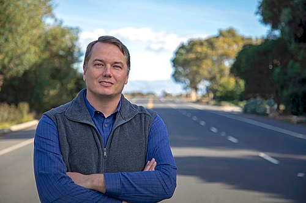
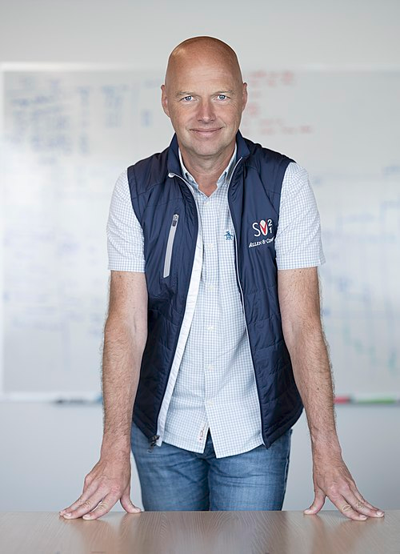
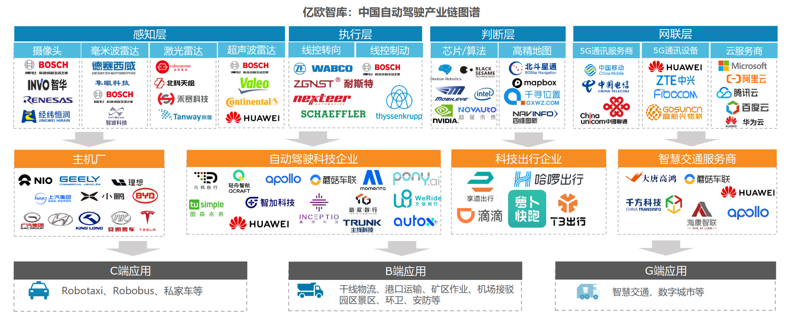

浅显地了解自动驾驶二十年的发展过程，希望可以启发自己对商业模式、技术变现的反思与理解。

## 目录

- [目录](#目录)
- [1. 前言：自动驾驶发展脉络](#1-前言自动驾驶发展脉络)

## 1. 前言：自动驾驶发展脉络

往前追溯二十年，个人电脑刚刚普及的时代，自动驾驶的概念就已经被提出。2004 年 DARPA（美国国防高级研究计划局）组织了第一届自动驾驶挑战赛，谷歌（成立于1998 年）、特斯拉（成立于2003 年）、英特尔（成立于1968 年）等科技巨头纷纷入局。但在那个时代背景下，自动驾驶仅仅是个概念，需要学术界先去探索。比如英特尔研究院的战略是只做 3~5 年内可商业化的技术，兼顾抢占市场和技术变现。他们将 3 年内可商业化的技术交给产品部门落地，其他的技术通过与学术界合作推动。自动驾驶就属于英特尔与斯坦福大学合作的项目之一。

2007 年之前是挑战赛引流，之后是各大科技公司养蛊+吸金，比如谷歌的无人车项目（后来的 Waymo）、特斯拉的 Autopilot、英特尔的 Mobileye 等。这些公司创立过程的各种纠葛也值得梳理一下：谷歌于 2007 年吸纳了斯坦福大学的自动驾驶项目（Stanley 团队，由 Thrun 领导），随后成立了无人驾驶项目（Google Self-Driving Car Project），2016 年正式独立为 Waymo；特斯拉在 2014 年推出了 Autopilot 功能，早期核心技术供应商是以色列的 Mobileye，2016 年因致命事故分道扬镳，特斯拉转向自研，Mobileye 则在 2017 年被英特尔收购；

> 谷歌无人车项目的骨干们：核心工程师 Levandowski 在谷歌无人车项目后创立了 Otto（专注于自动驾驶卡车），2016 年被 Uber 收购，成为优步自动驾驶部门的核心，但因知识产权纠纷引发了行业大案；创始人 Thrun 领导了谷歌无人车项目，后来创立了 Udacity（在线教育平台），并继续推动自动驾驶技术的研究和应用；技术负责人 Urmson 则在谷歌无人车项目后创立了 Aurora（专注于自动驾驶技术的公司），并与 Uber、Lyft 等公司合作推动自动驾驶技术的商业化。

|[Levandowski](https://en.wikipedia.org/wiki/Anthony_Levandowski)|[Urmson](https://en.wikipedia.org/wiki/Chris_Urmson)|[Thrun](https://en.wikipedia.org/wiki/Sebastian_Thrun)|
|---|---|---|
||||

2016 年之后，自动驾驶进入了商业化的快车道。Waymo 推出了 Robotaxi 服务，特斯拉推出了 FSD（Full Self-Driving）功能，Mobileye 则专注于为汽车制造商提供自动驾驶解决方案。此时国内的自动驾驶公司也开始崛起，如百度的 Apollo（2017 年，百度自动驾驶开放平台，技术积累深厚，L4/L2+并行推进）、滴滴的自动驾驶部门 Voyager（2016 年启动，2019 年独立，专注于网约车场景）、小马智行 Pony.ai（2016 年，主攻 Robotaxi，已在中美多地落地测试）、文远知行 WeRide（2017 年，专注 Robotaxi 和自动驾驶小巴，广州为主要试点城市）、Momenta（2016 年，强调数据驱动、算法领先，L2/L4双线布局）、驭势科技 UISEE（2016 年，专注于园区、物流、机场等限定场景的无人驾驶）、智加科技 Plus（2016 年，主攻自动驾驶卡车）、蘑菇车联（2017 年，聚焦智慧城市与车路协同）、轻舟智航 QCraft（2019 年，自动驾驶公交和Robotaxi）、纵目科技（2013 年，专注于量产ADAS和自动泊车）、禾多科技（2017 年，L2+/L3自动驾驶方案）等。这些公司在技术路径、商业模式和应用场景上各有侧重，推动了中国自动驾驶产业的多元化发展。

2021 年，曾经意气风发的 L4 公司开始动摇。L4 路线代表着典型的学术思维，强调“优雅地突破新问题”，追求技术上的飞跃和全自动驾驶的终极目标。而渐进派则更偏向工程思维，注重“务实地解决现有问题”，强调技术的可落地性和商业化路径。渐进派主要分为两类：一类是 **L2+ 辅助驾驶路线**（如特斯拉、蔚来、小鹏、理想、华为等），通过量产和数据积累不断迭代升级；另一类是**带约束的 L4 解决方案**（如百度、文远知行、小马智行、滴滴等），从限定场景的产业应用或最后几公里的低速场景切入。渐进路线强调长期可持续发展，要求企业具备自我造血能力，而不是单纯依赖融资和烧钱扩张。特斯拉的市值一度突破 1.2 万亿美元，超过全球前十家汽车公司市值之和。尽管马斯克几乎每年都宣称年底实现 L5 自动驾驶，屡次跳票却丝毫不影响特斯拉在智能驾驶数据和里程积累上的领先地位。与之形成鲜明对比的是，Waymo 的估值从投行曾经预期的 1750 亿美元跌至 300 亿美元，Aurora、图森等公司虽然顺利上市，一度风光无限，但到 2023 年市值已缩水九成以上。

> 中国虽然没有特斯拉，但一批原本专注 Robotaxi 的公司（小马智行、文远知行、驭势科技等）开始走特斯拉的老路，将 L4 技术降维应用到 L2 级别，推出对标特斯拉 FSD 的城市 NOA（Navigation on Autopilot）。Robotaxi 只需在限定区域实现无人驾驶，而城市 NOA 则要在全国范围内保证体验和安全，这也许是自动驾驶的终局路径之一。与此同时，中国还有更多公司选择从具体场景切入自动驾驶，在各自细分领域逐步走出独特的发展道路，这是美国市场所不具备的多样性。虽然行业整体进展不及预期，但与大挑战赛时代相比，技术能力已不可同日而语。

