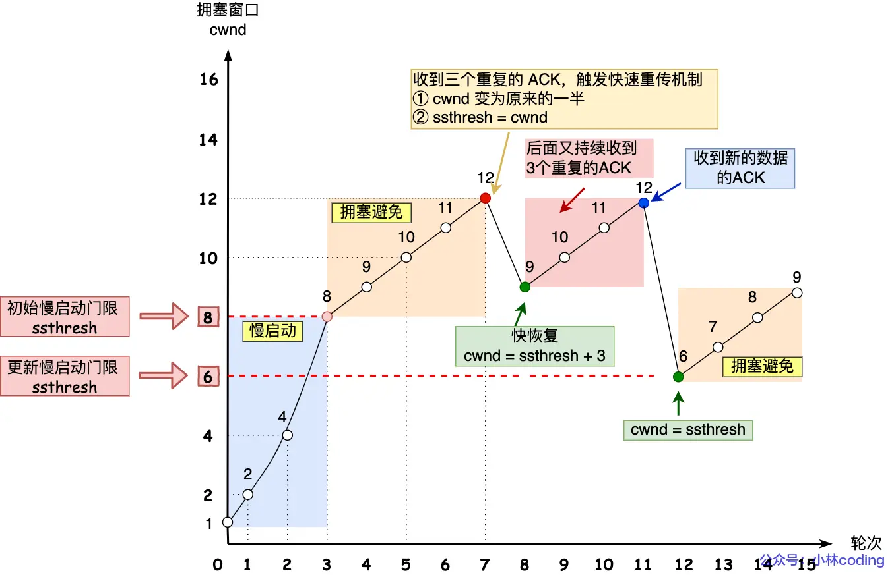
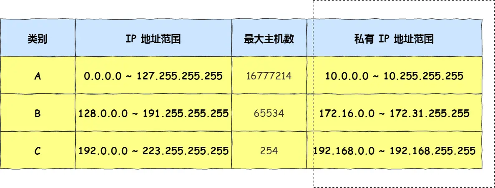

计网本质上是一些协议的集合，人为制定了一些规则来规范计算机之间的通信。计算机网络的学习可以分为以下几个部分：应用层（HTTP、HTTPS、RPC 等）、传输层（TCP、UDP）、网络层（IP 协议、路由协议等）、数据链路层（以太网、WiFi 等）和物理层（光纤、电缆等）。

## 目录

- [目录](#目录)
- [1. 网络体系](#1-网络体系)
- [2. 应用层](#2-应用层)
  - [2.1 HTTP 状态码](#21-http-状态码)
  - [2.2 HTTP 版本特性](#22-http-版本特性)
  - [2.3 HTTPS](#23-https)
  - [2.4 RPC](#24-rpc)
- [3 传输层](#3-传输层)
  - [3.1 TCP 字节流](#31-tcp-字节流)
- [4 网络层](#4-网络层)
  - [4.1 IP 地址](#41-ip-地址)
  - [4.2 路由控制](#42-路由控制)

## 1. 网络体系

计算机分层模型的设计初衷是为了模块化网络协议，使得每一层都可以独立地进行设计和实现。常见的分层模型有 OSI 七层模型和 TCP/IP 四层模型。
OSI 七层模型包括：物理层、数据链路层、网络层、传输层、会话层、表示层和应用层。
TCP/IP 模型则简化为四层：网络接口层、网络层、传输层和应用层（将会话层和表示层合并为应用层）。

| 层名         | 协议举例                                                                                   |
|:------------:|:------------------------------------------------------------------------------------------|
| 网络接口   | Ethernet, WiFi, PPP, Frame Relay, ATM, FDDI, Token Ring, ARP, RARP                        |
| 网络层       | IP (IPv4/IPv6), ICMP, IGMP, IPSec                                                         |
| 传输层       | TCP, UDP, SCTP, DCCP                                                                      |
| 应用层       | HTTP, HTTPS, FTP, SMTP, POP3, IMAP, DNS, Telnet, SSH, DHCP, SNMP, NTP, LDAP, RTP, SIP  |

- **数据链路层设备简介**
  - **网卡（NIC, Network Interface Card）**
    - 有唯一的 MAC 地址（Ethernet 网卡、WiFi 网卡等）。将帧发送到物理介质（交换机或路由器）。
  - **交换机（Switch）**
    - 根据 MAC 地址表转发数据帧。连接同一局域网 LAN 内的设备，负责局域网内部通信。
  - **路由器（Router）**
    - 常作为内网与外网（互联网）之间的网关。通过 IP 路由协议（如 OSPF、BGP）进行路由选择。
  - **网关（Gateway）**
    - 网络之间的连接点，可以是路由器、防火墙、代理服务器等。实现不同网络协议或类型之间的互通。

- **网络请求简要流程**
  1. 依次查询本地 DNS 缓存、hosts 文件、本地/递归 DNS 服务器，获取目标 IP。
  2. 根据 IP 地址通过 ARP 协议获取目标设备（目标主机/网关）的 MAC 地址。
  3. 网卡将帧发送到交换机，交换机根据 MAC 地址表转发到目标设备（目标主机或网关）。
  4. 路由器解包提取出 IP 数据报，并根据路由表进行路由选择（目标 IP/上级路由器）。

<p align="center">
  
</p>


## 2. 应用层

HTTP 是 Web 的基础协议，使用请求/响应模型。通常使用 TCP 端口 80，HTTPS 则在此基础上增加了 SSL/TLS 加密，使用端口 443。

根据 RFC 7230，GET 请求语义是请求获取指定资源（静态 HTML 文本、图片、视频等），参数一般写在 URL 中（只支持 ASCII 字符）。POST 提交表单时，表单数据被放在请求体（body）中发送给服务器。

<p align="center">
  
</p>

```yaml
GET /index.html HTTP/1.1                # 请求方法、路径、协议版本
Host: www.example.com                   # 必需，请求的主机名（虚拟主机支持）
User-Agent: Mozilla/5.0 (Windows NT 10.0; Win64; x64)  # 客户端软件信息
Accept: text/html,application/xhtml+xml,application/xml;q=0.9  # 可接受类型
Accept-Encoding: gzip, deflate, br      # 支持的内容压缩算法
Accept-Language: zh-CN,zh;q=0.9         # 首选语言
Connection: keep-alive                  # 是否保持长连接
Referer: https://www.example.com/home   # 请求来源页面
Cookie: sessionid=abc123; theme=dark    # 携带的 Cookie 信息
Authorization: Basic dXNlcjpwYXNz       # 认证信息（如 Basic、Bearer Token）
If-Modified-Since: Wed, 21 Oct 2025 07:28:00 GMT  # 协商缓存：上次修改时间
If-None-Match: "abc123"                 # 协商缓存：ETag
Content-Type: application/x-www-form-urlencoded    # 请求体的数据类型
Content-Length: 27                      # 请求体长度（字节数）

username=alice&password=123456          # 请求体内容（POST/PUT 提交的数据）
```

对于 HTTP 请求有安全和幂等的概念：
- **安全（Safe）**：不会修改服务器上的资源。GET、HEAD、OPTIONS 是安全的。
- **幂等（Idempotent）**：可以多次执行而不会改变服务器状态。GET、HEAD、PUT、DELETE 是幂等的。

| 方法   | 安全（Safe） | 幂等（Idempotent） | 说明                         |
|--------|:------------:|:------------------:|------------------------------|
| GET    | 是           | 是                 | 获取资源                     |
| HEAD   | 是           | 是                 | 类似 GET，只返回响应头        |
| OPTIONS| 是           | 是                 | 查询服务器支持哪些方法        |
| PUT    | 否           | 是                 | 更新/替换资源                |
| DELETE | 否           | 是                 | 删除资源                     |
| POST   | 否           | 否                 | 新建资源或提交数据           |
| PATCH  | 否           | 否                 | 局部更新资源                 |


HTTP 支持将多次请求相同资源的响应结果缓存起来，减少网络传输和服务器负担。

1. **强制缓存**：由浏览器判断是否使用缓存（只要缓存未过期）。
   - 字段一：`Cache-Control: max-age=3600`：相对时间，优先级更高。
   - 字段二：`Expires: Wed, 21 Oct 2025 07:28:00 GMT`：绝对时间，缓存到期时间。
   - `Cache-Control: no-cache`：不使用缓存，强制重新验证（即使用协商缓存）。
2. **协商缓存**：客户端根据上次响应头中的 `Last-Modified` 或 `ETag`，在下次请求时通过请求头 `If-Modified-Since` 或 `If-None-Match` 发送给服务器。服务器对比这些标识，判断资源是否发生变化：
   - 如果资源已修改，则返回新资源（200 OK）及最新的 `Last-Modified` 或 `ETag`。
   - 如果资源未修改，则返回 304 Not Modified，客户端可直接使用本地缓存。
   - 相关字段说明：
     - 请求头 `If-Modified-Since: Wed, 21 Oct 2025 07:28:00 GMT`：上次资源修改时间
     - 响应头 `Last-Modified: Wed, 21 Oct 2025 07:28:00 GMT`：服务器资源最新修改时间
     - 请求头 `If-None-Match: "abc123"`：客户端发送的上次资源 ETag（唯一标签）
     - 响应头 `ETag: "abc123"`：服务器返回的资源 ETag（ETag 的优先级高于 Last-Modified）。

### 2.1 HTTP 状态码

| 状态码类别 | 说明           | 常见状态码及含义                                                                                 |
|:----------:|:--------------|:-----------------------------------------------------------------------------------------------|
| 1xx        | 提示信息       | 100 Continue：继续，收到请求的初始部分，客户端继续发送其余（实际很少用）             |
| 2xx        | 成功           | 200 OK：请求成功，返回数据<br>204 No Content：请求成功，无响应体<br>206 Partial Content：部分内容（用于断点续传） |
| 3xx        | 重定向         | 301 Moved Permanently：永久重定向<br>302 Found：临时重定向<br>304 Not Modified：资源未修改，可用缓存 |
| 4xx        | 客户端错误     | 400 Bad Request：请求有误<br>403 Forbidden：禁止访问<br>404 Not Found：资源不存在                |
| 5xx        | 服务器错误     | 500 Internal Server Error：服务器内部错误<br>501 Not Implemented：未实现<br>502 Bad Gateway：网关错误<br>503 Service Unavailable：服务不可用 |

### 2.2 HTTP 版本特性

<p align="center">
  
</p>

1. **HTTP/1.0**
   - 无状态：每个请求独立，服务器不会自动保存会话信息；但可以通过 Cookie 等机制实现会话状态管理。
   - 明文传输：数据以明文形式传输，易被窃听和篡改。
2. **HTTP/1.1**（管道化基本没用）
   - 持久连接：默认启用 `Keep-Alive`，允许在同一 TCP 连接上发送多个请求（直到主动断开或超时）。
   - 管道化：允许客户端发送多个请求而不等待响应，但服务器必须按顺序处理（仍然有队头阻塞问题）。
    ```plain
    +-----------------------------------------------+
    |                 Length (24)                   |
    +---------------+---------------+---------------+
    |   Type (8)    |   Flags (8)   |
    +-+---------------------------------------------+
    |R|             Stream Identifier (31)          |
    +=+=============================================+
    |                   Frame Payload (*)           |
    +-----------------------------------------------+
    ```
3. **HTTP/2**
   - HPACK 压缩：基于静态和动态表对请求头进行压缩，基于 Huffman 编码，减少头部开销。
   - 二进制分帧：将报文分为头部和数据帧，使用二进制格式传输，减少解析开销。
   - 并发传输：多个 Stream 共用一个 TCP 连接。流内有多个 Message，消息内有多个 Frame 帧。
     - 接收端按 Stream ID 组装消息，Stream 可以乱序接收，避免队头阻塞。

   - 服务器推送：HTTP/2 的客户端/服务器分别使用奇数/偶数 Stream ID 发起请求和推送
     - 服务器推送时先通过 PUSH_PROMISE 帧声明推送资源，然后通过 promised Stream ID 流发送。

        <p align="center">
        
        </p>

4. **HTTP/3**（QUIC）

    HTTP/2 虽然解决了响应队头阻塞，仍存在 TCP 层的队头阻塞。所以引入基于 UDP 的 QUIC 协议。

   1. **无队头阻塞**：使用多路复用的流（Stream），丢包只会导致某个流阻塞，不会影响其他流。

   2. **连接迁移**：使用连接 ID 来标识连接，而不是传统的 IP:port。连接可以在网络之间无缝切换。

   3. **快速握手**：QUIC 内置 TLS 1.3，握手只需一个 RTT（Round Trip Time），减少延迟。


### 2.3 HTTPS

HTTPS（HTTP over TLS）在 HTTP 协议之上增加了 SSL/TLS 层，提供数据加密、完整性校验和身份验证。

- **数据加密**：建立连接时用非对称加密（如 RSA）交换会话密钥；通信时用对称加密（如 AES）加密数据。
- **完整性校验**：使用 HMAC（Hash-based Message Authentication Code）对数据进行完整性校验。
  - 发送端生成**数字摘要**，私钥加密生成**数字签名**。接收端公钥解密后对比摘要，确保数据未被篡改。
- **身份验证**：使用 CA（Certificate Authority）颁发的数字证书验证服务器身份（确保公钥真实可信）。
  - 服务器将**数字证书**（服务器公钥、CA 签名）发送给客户端，客户端使用 CA 公钥验证 CA 签名。

<p align="center">
  
</p>

> TCP 的第三次握手可以携带 TLS 握手信息，TLS 握手在 TCP 连接建立后进行。HTTP/2 + TLS1.2 的握手总时延为 3 RTT（Round Trip Time），而 HTTP/3 + TLS1.3 的握手总时延为 1 RTT。


### 2.4 RPC

RPC（Remote Procedure Call）是一种远程过程调用协议，允许程序调用远程服务器上的函数或方法，就像调用本地函数一样。常见的 RPC 协议有 gRPC、Thrift、JSON-RPC 等。

早期 HTTP 主要用于 Browser-Server 模型的请求响应，RPC 则用于 Client-Server 模型的函数调用。RPC 协议通常使用二进制协议（如 Protobuf）进行高效序列化和反序列化。

1. **服务发现**：
   - HTTP 通常通过 DNS 或负载均衡器进行服务发现。
   - RPC 协议通常使用服务注册中心（如 Consul、Etcd、Zookeeper、CoreDNS）来管理服务实例。
2. **连接方式**：
   - HTTP 通常使用长连接（Keep-Alive）或短连接。
   - RPC 协议通常通过 TCP 长连接进行通信。一般还会建立连接池，复用连接以减少连接开销。
3. **传输内容**：
   - HTTP 传输的是请求和响应报文，通常是 JSON、XML 等文本格式。
   - RPC 协议传输的是函数调用请求和响应，通常使用二进制格式（如 Protobuf）进行高效序列化。


## 3 传输层

传输层负责确保数据的**有序**、**完整**、**可靠**传输。协议有 TCP 和 UDP,提供分段、重组、流量控制和错误检测等功能。在网络层的 IP 协议只运输不保价。

1. **TCP（传输控制协议）**（面向连接、可靠、字节流）
   - 面向连接：一对一连接（通过三次握手建立连接），慢但是可靠（适合传输大数据）。
   - 可靠性：无论网络链路如何变化，TCP 都能确保数据的可靠传输。
   - 字节流：将数据视为连续的字节流，分段传输，接收端按顺序重组（根据序列号）。

    > 建立一个 TCP 连接需要客户端与服务段达成三个共识：Socket，序列号、窗口大小。TCP并发连接的数量限制取决于：1）理论 IP数 * 端口数（65535），2）文件描述符上限（`ulimit -n`），3）内存限制（每个连接需要分配内存）。TCP 连接的状态可以通过 `netstat` 命令查看。

2. **UDP（用户数据报协议）**（无连接、不可靠、数据报）
   - 无连接：多对多连接（不建立连接，数据包直接发送），适合实时应用（如直播、在线游戏等）。
   - 不可靠：不保证数据包送达、顺序和完整，但 QUIC 解决了这一问题。
   - 数据报：将数据视为独立的数据报文（节省头部开销），发送时不进行分段和重组（由 IP 层负责）。

    > 相比于 TCP，UDP 头部更小（8 字节），没有序列号、确认应答、首部长度（头部长度固定）等字段，并且由于传送独立的数据报，不会有粘包和拆包问题（需要应用层确保消息完整）

|TCP 头部字段|UDP 头部字段|
|:----------:|:----------:|
|||

### 3.1 TCP 字节流

1. **三次握手（建立连接）**

    |三次握手|四次挥手|
    |:------:|:--------:|
    |||

    <p align="center">
    
    </p>


    前两次握手用于确认双方的接收能力，后两次握手用于确认双方的发送能力。从第三次握手开始，双方开始发送数据。如果只有两次握手，当客户端发送 SYN 而服务端接收后，两端都进入 ESTABLISHED 状态，但服务端无法确认客户端是否准备好接收数据，也无法确认返回的 ACK 是否到达客户端。如果客户端无法接收数据，会导致半连接问题。如果有历史连接未关闭，服务器可能会建立一个历史连接，浪费资源。

    ```cpp
    socket(AF_INET, SOCK_STREAM, 0); // (AF_INET: IPv4, SOCK_STREAM: TCP, 0: 默认协议)
    bind(fd, &addr, sizeof(addr));  // 绑定本地地址和端口
    listen(fd, backlog);            // 监听端口，backlog 是半连接队列大小
    accept(fd, &addr, &addr_len);   // 接受连接，返回新的 socket fd

    connect(fd, &addr, sizeof(addr)); // 客户端连接到服务端
    ```

2. **四次挥手（断开连接）**

    客户端和服务端都需要发送一次 FIN 报文，表示不再发送数据。也都需要发送一次 ACK 报文，确认收到对方的 FIN 报文。

    客户端要经过三个等待阶段才能关闭连接：
    FIN_WAIT_1 为了等待服务端的 ACK，FIN_WAIT_2 为了等待服务端的 FIN，TIME_WAIT 为了确保最后的 ACK 能被对方接收。TIME_WAIT 状态持续 2MSL（Maximum Segment Lifetime），通常为 2 分钟。目的是确保最后的 ACK 能被对方接收，并防止旧的重复报文干扰新的连接。

    服务端要经过两个等待阶段才能关闭连接：CLOSE_WAIT 为了等待应用程序关闭连接，LAST_ACK 为了等待客户端的 ACK。

    TIME_WAIT 状态的持续时间是 2MSL（Maximum Segment Lifetime），通常为 1 分钟。目的是确保最后的 ACK 能被对方接收，并防止旧的重复报文干扰新的连接。（可以通过 `net.ipv4.tcp_fin_timeout` 参数调整，或通过 `SO_LINGER` 选项在关闭连接时立即释放资源）

    > TCP 的初始序列号（ISN）是由时钟生成的一个随机数。TCP 比 UDP 多一个分段机制。虽然 IP 层也有 MTU（最大传输单元）限制，但 IP 层没有超时重传机制，当发生丢包时只能重新发送整个数据包。TCP 在建立连接时会协商 MSS（最大报文段长度），确保每个 TCP 分段都不会超过 IP 层的 MTU 限制。

- 半连接/全连接队列

    TCP 连接的半连接队列（SYN 队列）和全连接队列（Accept 队列）用于存储未完成握手的连接和已完成握手的连接。
    
    - 半连接队列：存储处于 SYN_RECV 状态的连接（即已收到 SYN 请求但未收到 ACK）。
    - 全连接队列：存储处于 ESTABLISHED 状态的连接。 当客户端发送 ACK 后，将其移到全连接队列。

    半连接队列的大小由 `net.ipv4.tcp_max_syn_backlog` 参数控制，全连接队列的大小由 `net.core.somaxconn` 和 `listen(fd, backlog)` 的较小值共同控制。开启　`net.ipv4.tcp_syncookies` 可以防止 SYN Flood 攻击（SYN 队列满后，服务器返回　SYN Cookie 而不是存储 SYN 请求）。

- 超时重传

    TCP 的握手和挥手都使用超时重传机制。比如**长时间**（RTO，根据 RTT 动态调整）处于 SYN_SENT, SYN_RECV, FIN_WAIT_1, LAST_ACK 时会触发重传机制。TCP 的重传次数由 `/proc/sys/net/ipv4/tcp_syn_retries` 参数控制，超时时间则写死在内核中，通常为 3 秒。可以这样理解：超时重传用于确保对方收到自己的 SYN 或 FIN 时。

- 快速重传

    在**连续**三次收到**重复**应答号的 ACK 时，发送端会立即重传丢失的分段，而不等待 RTO 超时。此外还有 Duplicate SACK 方法协助确认重传哪些分段：客户端应答时将重复收到的分段序列号存入　SACK 选项中。发送端可以确定：丢包　or 网络延迟。

- 滑动窗口

    发送方维护发送窗口（Send Window），可用窗口大小　SND.WND - (SND.NXT - SND.UNA)
    ```plain
    |<------------------- SND.WND ------------------->|
    |                            |                    |
    |SND.UNA　　　　　　　　　　　　 |SND.NXT             |   
    ```                 

    接收方维护接收窗口（Receive Window），可用窗口大小 RCV.WND
    ```plain
    |<------------------- RCV.WND ------------------->|
    |                                                 |
    |RCV.NXT                                          |
    ```

  1. **流量控制**
    接收方通过 ACK 报文中的窗口大小（Receive Window）告知发送方当前可用的缓冲区大小。发送方根据接收方的窗口大小调整发送速率。当接收窗口为 0 时，发送方会停止发送数据，并定期发送窗口探测报文（Window Probe）以确认接收方是否恢复了缓冲区空间。并且为了提高发送效率，接收方会在窗口大小大于 MSS（Minimum Segment Size）时才打开窗口。发送方采用 Nagle 算法（`tcp_nodelay`）来合并小数据包，减少小包发送的频率。

  2. **拥塞控制**
    在发生超时重传时触发拥塞控制，即发送方维护一个拥塞窗口（Congestion Window, swnd=min(cwnd, rwnd)），通过慢启动、拥塞避免、快速重传和快速恢复等算法来控制拥塞。
      - **慢启动**：初始 cwnd 为 1 MSS，每收到一个 ACK，cwnd 翻一倍，直到达到慢启动阈值（ssthresh）。当发生丢包时，cwnd 降为 1 MSS。
      - **拥塞避免**：当 cwnd 达到慢启动阈值（ssthresh）时，进入拥塞避免阶段。每收到一个 ACK，cwnd 增加 1/cwnd MSS（线性增长）。
      - **快速重传**：收到三个重复 ACK 时，立即重传丢失的分段，并将 ssthresh 设置为当前 cwnd 的一半。
      - **快速恢复**：在快速重传后，cwnd 设置为 ssthresh + 3 MSS，进入快速恢复阶段。每收到一个 ACK，cwnd 增加 1 MSS，直到收到一个新的 ACK 后快速恢复结束，更新 ssthresh 和 cwnd 为当前值的一半，进入拥塞避免阶段。

    

## 4 网络层

网络层负责实现端到端通信，主要协议是 IP（Internet Protocol）。IP 协议提供无连接、不可靠的服务，数据包可能会丢失、重复或乱序。

### 4.1 IP 地址

|IP 地址|子网掩码|CIDR|地址范围|
|:------:|:-------:|:---:|:------:|
|A类：|255.0.0.0|/8|0.0.0.0 - 127.255.255.255|
|B类：|255.255.0.0|/16|128.0.0.0 - 191.255.255.255|
|C类：|255.255.255.0|/24|192.0.0.0 - 223.255.255.255|
|D类：|255.255.255.255|/32|224.0.0.0 - 239.255.255.255|
|E类：|无|无|240.0.0.0 - 255.255.255.255|

A,B,C 类地址用于主机通信，D 类地址用于多播，E 类地址保留用于实验和未来使用。其区分点主要在于前缀的位数：A 类地址前缀为 0，B 类前缀为 10，C 类前缀为 110，D 类前缀为 1110，E 类前缀为 1111。为了划分　A,B,C　类的网络层次，通常使用**子网掩码**来区分网络号和主机号（网络地址+子网络地址+主机地址）。

A,B,C 类地址又可以分为**公网地址**和**私有地址**。公网地址可以在互联网上路由，私有地址只能在局域网内使用。公网地址由　ICANN 分配，私有地址由内部　IT 人员管理。
<p align="center">
  
</p>

每类　IP 中都有两个特殊的主机地址：**网络地址**：用于标识子网，不能分配给主机。（主机号全为 0）**广播地址**：用于向子网内所有主机发送消息。（主机号全为 1），发送给广播地址的消息会被子网内所有主机接收。D 类地址用于多播，由于广播无法穿透路由器，所以使用**多播地址**用于在多个子网之间进行组播（通过组编号标识）。

### 4.2 路由控制

路由表是所有具备网络协议栈的设备（主机、路由器等）都必须维护的数据结构。它包含了网络中各个目标地址的路由信息，用于决定数据包的转发路径。路由表条目通常包括目标网络、子网掩码、下一跳地址和出接口。可用　`ip route` 命令查看和管理主机的路由表。

1. **路由过程**

   当主机发送数据包时，首先查找本地路由表，根据　IP 包的目标网络匹配路由表条目。最长匹配到的条目决定了数据包的下一跳地址和出接口。数据包通过该接口发送到下一跳设备（通常是路由器），路由器再根据其路由表继续转发数据包，直到到达目标主机。主机有一个特殊的环流接口（Loopback Interface），通常是 `127.0.0.1`。
