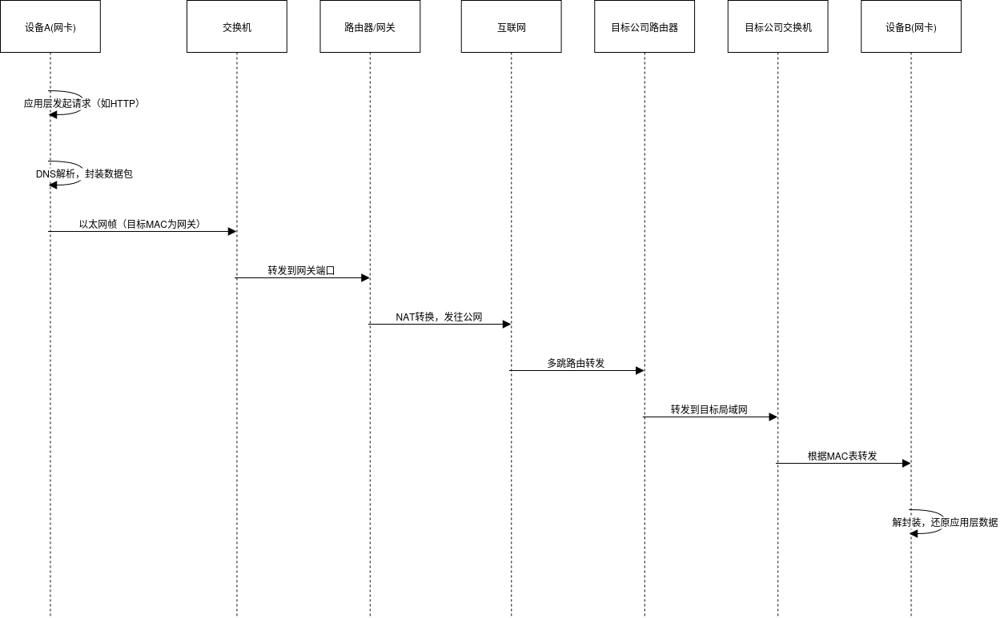
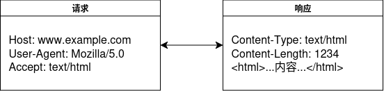
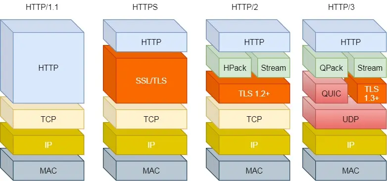
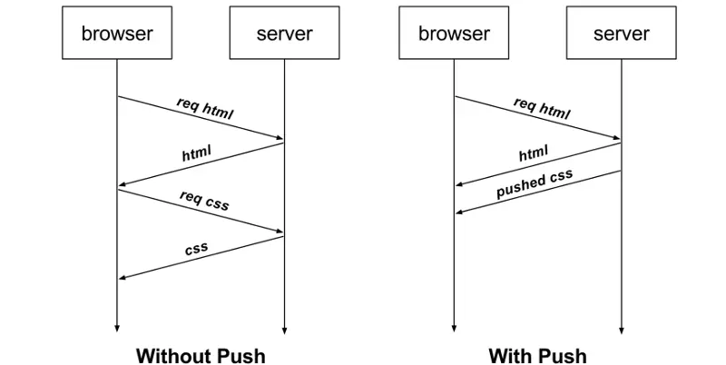
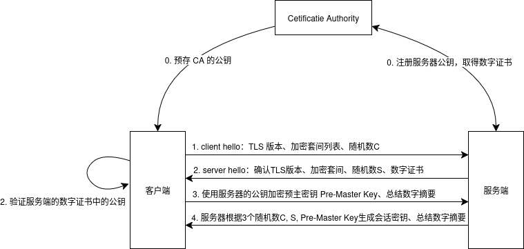
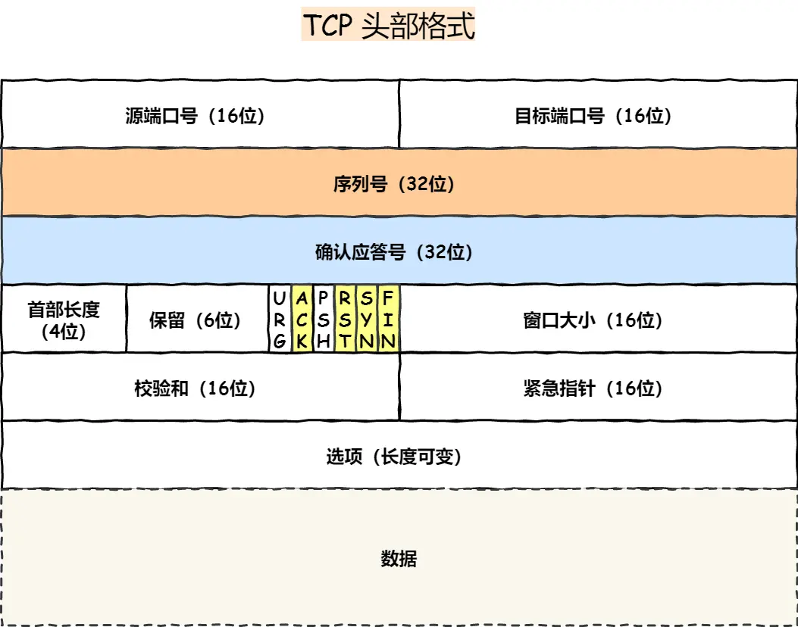
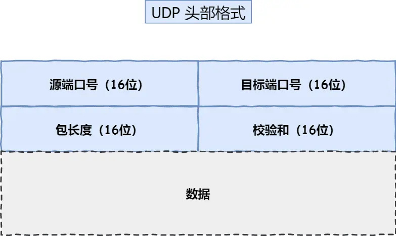
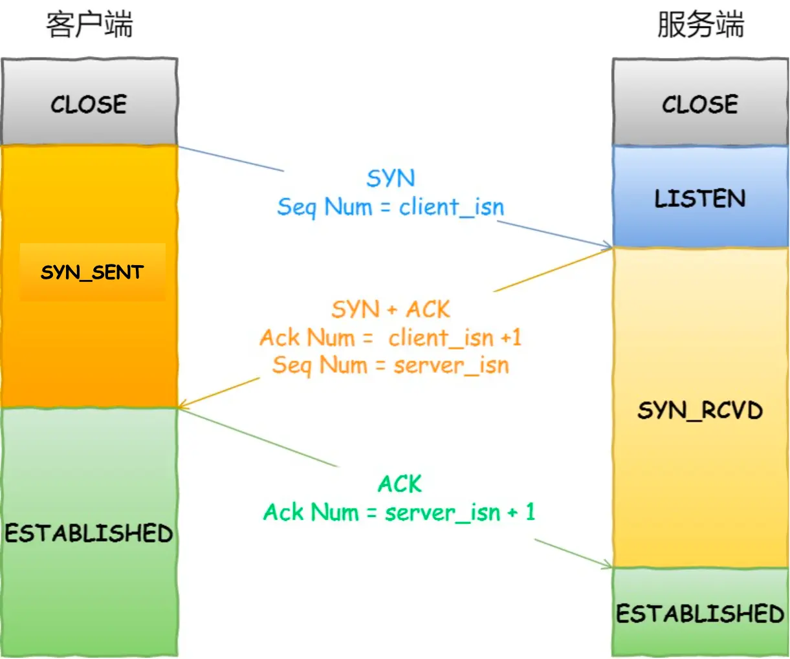
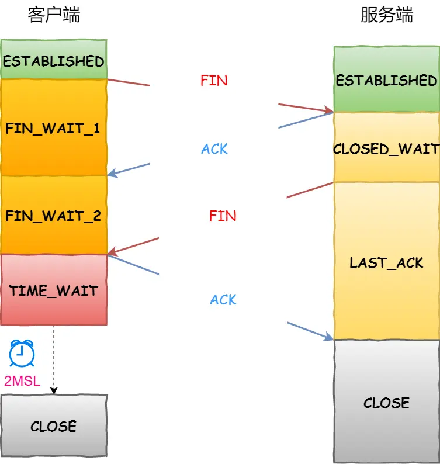
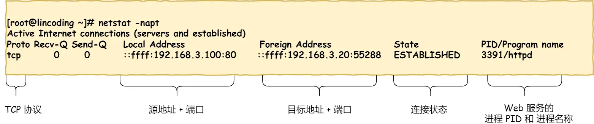

计网本质上是一些协议的集合，人为制定了一些规则来规范计算机之间的通信。计算机网络的学习可以分为以下几个部分：

# 1. 网络体系

计算机分层模型的设计初衷是为了模块化网络协议，使得每一层都可以独立地进行设计和实现。常见的分层模型有 OSI 七层模型和 TCP/IP 四层模型。

OSI 七层模型包括：物理层、数据链路层、网络层、传输层、会话层、表示层和应用层。TCP/IP 模型则简化为四层：网络接口层、网络层、传输层和应用层（将会话层和表示层合并为应用层）。

| 层名         | 协议举例                                                                                   |
|:------------:|:------------------------------------------------------------------------------------------|
| 网络接口层   | Ethernet, WiFi, PPP, Frame Relay, ATM, FDDI, Token Ring, ARP, RARP                        |
| 网络层       | IP (IPv4/IPv6), ICMP, IGMP, IPSec                                                         |
| 传输层       | TCP, UDP, SCTP, DCCP                                                                      |
| 应用层       | HTTP, HTTPS, FTP, SMTP, POP3, IMAP, DNS, Telnet, SSH, DHCP, SNMP, NTP, LDAP, RTP, SIP 等  |


- 数据链路层设备简介
  - 网卡（NIC, Network Interface Card）
    有唯一的 MAC 地址，常见有 Ethernet 网卡、WiFi 网卡等。用于直接连接到物理介质（交换机或路由器）。

  - 交换机（Switch）
    根据 MAC 地址表转发数据帧。连接同一局域网内的设备，负责局域网内部通信。

  - 路由器（Router）
    根据 IP 地址和路由表转发路径。连接不同网络（如局域网和广域网），负责跨网络通信（也是内网的网关）。

  - 网关（Gateway）
    通常是路由器的功能，连接不同协议或网络。可以是硬件设备或软件服务。路由器、防火墙、代理服务器。




## 1.1 应用层
应用层是用户直接交互的层。常见的应用层协议有 HTTP、HTTPS、FTP、SMTP、POP3、IMAP、DNS 等。

HTTP 是 Web 的基础协议，使用请求/响应模型。通常使用 TCP 端口 80，HTTPS 则在此基础上增加了 SSL/TLS 加密，使用端口 443。

根据 RFC 7230，GET 请求语义是请求获取指定资源（静态 HTML 文本、图片、视频等），参数一般写在 URL 中（只支持 ASCII 字符）。请求头部包含 Host、User-Agent、Accept 等字段。POST 提交表单请求则是根据 GET 报文体的内容进行处理，将数据放在请求体中。



```
GET /index.html HTTP/1.1
Host: www.example.com
User-Agent: Mozilla/5.0 (Windows NT 10.0; Win64; x64)
Accept: text/html,application/xhtml+xml,application/xml;q=0.9
Accept-Encoding: gzip, deflate, br
Accept-Language: zh-CN,zh;q=0.9
Connection: keep-alive
Referer: https://www.example.com/home
Cookie: sessionid=abc123; theme=dark
Authorization: Basic dXNlcjpwYXNz
If-Modified-Since: Wed, 21 Oct 2025 07:28:00 GMT
If-None-Match: "abc123"
Content-Type: application/x-www-form-urlencoded
Content-Length: 27

username=alice&password=123456
```

### 1.1.1 HTTP 安全和幂等

对于 HTTP 请求有安全和幂等的概念，
- 安全（Safe）：请求不会对服务器资源造成副作用。
- 幂等（Idempotent）：多次请求同一资源，结果相同。

    | 方法   | 安全（Safe） | 幂等（Idempotent） | 说明                         |
    |--------|:------------:|:------------------:|------------------------------|
    | GET    | 是           | 是                 | 获取资源，不修改服务器数据    |
    | HEAD   | 是           | 是                 | 类似 GET，只返回响应头        |
    | OPTIONS| 是           | 是                 | 查询服务器支持哪些方法        |
    | PUT    | 否           | 是                 | 更新/替换资源                |
    | DELETE | 否           | 是                 | 删除资源                     |
    | POST   | 否           | 否                 | 新建资源或提交数据|
    | PATCH  | 否           | 否                 | 局部更新资源|

### 1.1.2 HTTP 缓存技术

HTTP 支持缓存技术，将多次请求相同资源的响应结果缓存起来，减少网络传输和服务器负担。

1. 强制缓存：由浏览器判断是否使用缓存（只要缓存未过期），通过响应头中的 Cache-Control 和 Expires 字段来控制。
   - `Cache-Control: max-age=3600`：相对时间，缓存有效期为 1 小时。
   - `Expires: Wed, 21 Oct 2025 07:28:00 GMT`：绝对时间，缓存到期时间。
   - `Cache-Control: no-cache`：不使用缓存，强制重新验证（即使用协商缓存）。

2. 协商缓存：由服务器判断是否使用缓存（对比缓存和服务器资源），通过请求头中的 If-Modified-Since 和 If-None-Match 字段，以及响应头中的 Last-Modified 和 ETag 字段来实现。
   - 在客户端收到响应头带有 Last-Modified 或 ETag 时，会在下次请求时带上 If-Modified-Since 或 If-None-Match。服务器对其进行对比，若资源修改则返回新资源 200 OK，若未修改则返回 304 Not Modified。
     - 请求头 `If-Modified-Since: Wed, 21 Oct 2025 07:28:00 GMT`：客户端发送的最后修改时间（同时发送 Last-Modified）
     - 响应头 `Last-Modified: Wed, 21 Oct 2025 07:28:00 GMT`：服务器返回的资源最后修改时间
     - 请求头 `If-None-Match: "abc123"`：客户端发送的 ETag（实体标签），唯一标识资源版本，优先级高于修改时间
     - 响应头 `ETag: "abc123"`：服务器对比 If-None-Match，若匹配则返回 304 Not Modified，否则返回新资源 200 OK

### 1.1.3 HTTP 状态码
| 状态码类别 | 说明           | 常见状态码及含义                                                                                 |
|:----------:|:--------------|:-----------------------------------------------------------------------------------------------|
| 1xx        | 提示信息       | 100 Continue：继续，收到请求的初始部分，客户端应继续发送请求的其余部分（实际很少用）             |
| 2xx        | 成功           | 200 OK：请求成功，返回数据<br>204 No Content：请求成功，无响应体<br>206 Partial Content：部分内容（用于断点续传） |
| 3xx        | 重定向         | 301 Moved Permanently：永久重定向<br>302 Found：临时重定向<br>304 Not Modified：资源未修改，可用缓存 |
| 4xx        | 客户端错误     | 400 Bad Request：请求有误<br>403 Forbidden：禁止访问<br>404 Not Found：资源不存在                |
| 5xx        | 服务器错误     | 500 Internal Server Error：服务器内部错误<br>501 Not Implemented：未实现<br>502 Bad Gateway：网关错误<br>503 Service Unavailable：服务不可用 |

### 1.1.4 HTTP 版本特性



1. HTTP/1.0（无状态、明文传输）
   - 无状态：每个请求独立，不保留请求状态；（可以通过 Cookie 实现会话状态）
   - 明文传输：数据以明文形式传输，易被窃听和篡改。
2. HTTP/1.1（持久连接、管道化（基本没用））
   - 持久连接：默认启用 Keep-Alive，允许在同一 TCP 连接上发送多个请求（直到主动断开或超时），减少连接开销。
   - 管道化：允许客户端在发送请求时不等待响应，同时发送多个请求，但服务器必须按顺序处理响应，减少整体响应时间。
3. HTTP/2（二进制分帧、多路复用、头部压缩）
   - 二进制分帧：将请求和响应分为头信息帧、数据帧，提高传输效率。
   - 多路复用（并发）：引入 Stream，多个流共用一个 TCP 连接。流内的 Message 包含多个 Frame（二进制的请求/响应）。
     - 通过 Stream ID 区分不同请求/响应，接收端以此顺序组装。服务器也可以主动推送流（Stream ID 是偶数）。
        
   - 头部压缩：在客户端和服务器同时维护一个头部表（Header Table），使用索引代替重复的头部字段（HPACK 算法）

HTTP/1.1 的管道化没能解决响应头阻塞问题，HTTP/2 的多路复用在丢包时也会导致所有流阻塞。本质上一个是 HTTP 层阻塞（需要按顺序响应），一个是 TCP 层阻塞（需要按顺序传输）。所以 HTTP/3 引入了基于 UDP 的 QUIC 协议（Quick UDP Internet Connections）。

4. HTTP/3（基于 QUIC 协议）
   - 无队头阻塞：丢包只会导致某个流阻塞，不会影响其他流。
   - 连接迁移：不同于传统的四元组(源 IP:Port, 目的 IP:Port)，QUIC 使用连接 ID 来标识连接，实现无缝切换。
   - 内置加密：QUIC 内部包含 TLS 1.3，仅需一个 RTT 即可完成握手，减少延迟。

### 1.1.4 HTTPS

HTTP/2 和 HTTP/3 都基于 HTTPS（HTTP over TLS），提供加密传输。HTTPS 在 HTTP 协议之上增加了 SSL/TLS 层，提供数据加密、完整性校验和身份验证。

- 数据加密：在建立连接时采用非对称加密（如 RSA）交换会话密钥；在通信时使用对称加密（如 AES）加密数据。
- 完整性校验：使用 HMAC（Hash-based Message Authentication Code）对数据进行完整性校验。
  发送端对数据进行哈希运算生成**数字摘要**，使用私钥加密生成**数字签名**。接收端使用公钥解密后对比摘要，确保数据未被篡改。

- 身份验证：使用 CA（Certificate Authority）颁发的数字证书验证服务器身份（确保公钥真实可信）。
  服务器将**数字证书**（公钥、CA 签名）发送给客户端，客户端使用 CA 公钥验证 CA 签名，确保服务器公钥可信。



### 1.1.5 RPC 

RPC（Remote Procedure Call）是一种远程过程调用协议，允许程序调用远程服务器上的函数或方法，就像调用本地函数一样。常见的 RPC 协议有 gRPC、Thrift、JSON-RPC 等。

早期 HTTP 主要用于 Browser-Server 模型的请求响应，RPC 则用于 Client-Server 模型的函数调用。RPC 协议通常使用二进制协议（如 Protobuf）进行高效序列化和反序列化。

1. 服务发现：
   - HTTP 通常通过 DNS 或负载均衡器进行服务发现。
   - RPC 协议通常使用服务注册中心（如 Consul、Etcd、Zookeeper、CoreDNS）来管理服务实例。
2. 连接方式：
   - HTTP 通常使用长连接（Keep-Alive）或短连接。
   - RPC 协议通常通过 TCP 长连接进行通信。一般还会建立连接池，复用连接以减少连接开销。
3. 传输内容：
   - HTTP 传输的是请求和响应报文，通常是 JSON、XML 等文本格式。
   - RPC 协议传输的是函数调用请求和响应，通常使用二进制格式（如 Protobuf）进行高效序列化。

## 1.2 传输层

IP 协议仅负责将数据包从源地址传输到目的地址，不保证数据的有序、完整和传输可靠。所以需要传输层来提供端到端的通信。传输层的协议有 TCP 和 UDP，负责数据的分段、重组、流量控制和错误检测。

1. TCP（传输控制协议）
   - 面向连接：一对一连接（通过三次握手建立连接），慢但是可靠（适合传输大数据量）。
   - 可靠性：通过确认应答、重传机制、序列号和校验和、拥塞控制和流量控制确保数据包的可靠传输。
   - 字节流：将数据视为连续的字节流，分段传输，接收端按顺序重组。


2. UDP（用户数据报协议）
   - 无连接：不需要建立连接，数据包直接发送，适合实时应用。
   - 不可靠：不保证数据包送达、顺序和完整，适合实时性高、可靠性低的场景（如直播、在线游戏等）。
   - 头部开销小：UDP 头部只有 8 字节，适合传输小数据量。

|TCP 头部字段|UDP 头部字段|
|:----------:|:----------:|
|||

### 1.2.1 TCP 连接管理

1. 三次握手（建立连接）+ 四次挥手（断开连接）

    |三次握手|四次挥手|
    |:------:|:--------:|
    |||
    

    

   - 三次握手

    前两次握手用于确认双方的接收能力，后两次握手用于确认双方的发送能力。从第三次握手开始，双方开始发送数据。
    如果只有两次握手，当客户端发送 SYN 而服务端接收后，两端都进入 ESTABLISHED 状态，但服务端无法确认客户端是否准备好接收数据，也无法确认返回的 ACK 是否到达客户端。如果客户端无法接收数据，会导致半连接问题。如果有历史连接未关闭，服务器可能会建立一个历史连接，浪费资源。

   - 四次挥手

    客户端和服务端都需要发送一次 FIN 报文，表示不再发送数据。也都需要发送一次 ACK 报文，确认收到对方的 FIN 报文。
    客户端要经过三个等待阶段才能关闭连接：FIN_WAIT_1 为了等待服务端的 ACK，FIN_WAIT_2 为了等待服务端的 FIN，TIME_WAIT 为了确保最后的 ACK 能被对方接收。TIME_WAIT 状态持续 2MSL（Maximum Segment Lifetime），通常为 2 分钟。目的是确保最后的 ACK 能被对方接收，并防止旧的重复报文干扰新的连接。
    服务端要经过两个等待阶段才能关闭连接：CLOSE_WAIT 为了等待应用程序关闭连接，LAST_ACK 为了等待客户端的 ACK。

    TIME_WAIT 状态的持续时间是 2MSL（Maximum Segment Lifetime），通常为 1 分钟。目的是确保最后的 ACK 能被对方接收，并防止旧的重复报文干扰新的连接。

    四次挥手丢失都会触发重传机制，直到超过 tcp_fin_timeout 后放弃连接。

2. SYN Flood 攻击

   - 第一次握手丢失（SYN 丢失）
     客户端发送 SYN 报文，但服务端未收到（或响应丢失），客户端会超时重传 SYN，重试次数超过 `tcp_syn_retries` 后放弃连接。
   - 第二次握手丢失（SYN-ACK 丢失）
     服务端收到 SYN 并回复 SYN-ACK，但客户端未收到 SYN-ACK，客户端会重传 SYN，服务端收到重复 SYN 会再次发送 SYN-ACK。双方会持续重试，直到超过 `tcp_syn_retries` 后放弃。
   - 第三次握手丢失（ACK 丢失）
     客户端收到 SYN-ACK 并发送 ACK，但服务端未收到 ACK，服务端会重传 SYN-ACK，客户端收到重复 SYN-ACK 会再次发送 ACK。服务端重试次数超过 `tcp_syn_retries` 后关闭半连接。

    所谓 SYN Flood 攻击，就是攻击者发送大量 SYN 请求，占满服务器的半连接队列（SYN 队列），导致无法处理正常请求。正常情况下，服务器会将接收到 ACK 响应的连接从半连接队列（SYN 队列）移动到已连接队列（Accept 队列）。应用通过调用 accept() 函数从已连接队列中获取连接。

    应对 SYN Flood 攻击的常见方法有：
    1. 内核通过一个大小为 `net.core.netdev_max_backlog` 的队列来暂存网卡接收的数据包。
    2. 增大半连接队列（SYN 队列）的大小（同时增大三个参数）
     - `net.ipv4.tcp_max_syn_backlog`：半连接队列的最大长度。
     - `net.core.somaxconn`：套接字的最大连接数。
     - `listen()` 函数的第二个参数：`backlog`，指定半连接队列的长度。
    3. 开启 SYN Cookies：当半连接队列满时，服务器不再存储 SYN 请求，而是生成一个特殊的 SYN Cookie，在第二次握手时将其发送给客户端。客户端在第三次握手时将 SYN Cookie 作为 ACK 的一部分发送回服务器，服务器通过验证 SYN Cookie 来确认连接的合法性。
    4. 减少 tcp_syn_retries：减少重试次数，防止攻击者占用过多资源。

3. 优化 TIME_WAIT
   1. 开启复用处于 TIME_WAIT 状态的连接：通过设置 `net.ipv4.tcp_tw_reuse=1`，`net.ipv4.tcp_timestamp=1`
   2. 限制 TIME_WAIT 数量：通过设置 `net.ipv4.tcp_max_tw_buckets=18000` 超出后直接丢弃。
   3. 调用 `close()` 函数时设置 `SO_LINGER` 选项，在关闭连接时立即释放资源，而不进入 TIME_WAIT 状态。

    当服务器出现大量 TIME_WAIT 状态时，说明服务器频繁作为主动关闭方。常见原因包括：
      - HTTP 使用短连接（每次请求都新建和关闭连接，服务器主动关闭连接）
      - HTTP 长连接超时后由服务器主动断开（nginx 的 `keepalive_timeout` 设置）
      - 长连接上请求过多，服务器主动断开以释放资源（nginx 的 `max_requests` 设置）
    当服务器出现大量 CLOSE_WAIT 状态时，说明服务器频繁作为被动关闭方。常见原因包括：
      - 应用程序未及时关闭连接（如服务端未调用 `close()` 函数）
        1. 代码问题：未将 socket 注册到 epoll
        2. 新连接到来时未 accept
        3. 未调用 close() 函数关闭连接
4. MSS 分段

    虽然 IP 层也有 MTU（最大传输单元）限制，但 IP 层没有超时重传机制，当发生丢包时只能重新发送整个数据包。TCP 在建立连接时会协商 MSS（最大报文段长度），确保每个 TCP 分段都不会超过 IP 层的 MTU 限制。

### 1.2.2 TCP 重传机制、滑动窗口、流量控制、拥塞控制

1. 重传机制

    TCP 使用序列号和确认应答来确保数据的可靠传输。通过 `tcp_syn_retries` 参数控制重传次数。设定 RTT（Round Trip Time）为连接握手的平均**往返**时间。而 RTO（Retransmission Timeout）则是重传超时时间，通常设置为 RTT 的 1.5 倍。RTT 是一个动态时间间，会根据网络状况不断调整。

    除了超时重传，TCP 还使用快速重传机制。当接收端收到乱序的分段时，会发送重复的 ACK（即 ACK 序列号不变），表示期望收到的下一个分段。发送端在收到三个重复 ACK 时，会立即重传丢失的分段，而不等待 RTO 超时。为了帮助快速重传，TCP 还会使用 SACK（Selective Acknowledgment）选项（通过 `net.ipv4.tcp_sack` 开启），允许接收端告知发送端哪些分段已经收到，哪些分段丢失。

2. 滑动窗口

    TCP 使用滑动窗口机制提高传输效率（缓冲），同时提供流量控制、拥塞控制。滑动窗口本质是**无需等待应答而可以继续发送数据的最大值**。发送端维护一个发送窗口（Send Window），接收端维护一个接收窗口（Receive Window）。同时通过**累计确认**允许发送端通过最后一个 ACK 确认所有之前的分段。

    窗口大小通过指针控制：
    - **发送窗口**：`snd_una`（未确认的第一个字节序列号），`snd_nxt`（下一个要发送的字节序列号），`snd_wnd`（当前窗口大小）。
        可用窗口大小 = `snd_wnd` - (`snd_nxt` - `snd_una`)。
    - **接收窗口**：`rcv_nxt`（下一个期望接收的字节序列号），`rcv_wnd`（接收窗口大小）。
        可用窗口大小 = `rcv_wnd` - (`rcv_nxt` - `snd_una`)。
3. 流量控制

    TCP 通过流量控制让发送方根据接收方的接收能力调整发送速率。接收方通过 ACK 报文中的窗口大小（Receive Window）告知发送方当前可用的缓冲区大小。发送方根据接收窗口大小调整发送速率，避免发送过快导致接收方缓冲区溢出。

    由于操作系统不允许同时减少缓冲区和收缩滑动窗口大小，避免出现“缓冲区溢出”或“数据丢失”的情况。当接收方可用窗口为 0 时，发送方会停止发送数据，并定期发送窗口探测报文（Window Probe）以确认接收方是否恢复了缓冲区空间。

    糊涂窗口综合征是指：如果接收方每次只能处理少量数据，发送方频繁地每次只发送少量数据，导致网络资源的浪费和传输效率的降低。所以接收方会只在窗口大小 < MSS（Maximum Segment Size）时打开窗口。发送方采用 Nagle 算法（`tcp_nodelay`）来合并小数据包，减少小包发送的频率。

4. 拥塞控制

    发送方的滑动窗口值 `swnd` 是 `min(rwnd, cwnd)`，即取流量控制和拥塞控制的最小值。拥塞窗口（cwnd）是 TCP 为了控制网络拥塞而设置的一个窗口大小。TCP 使用慢启动、拥塞避免、快速重传和快速恢复等算法来控制拥塞。

    - **慢启动**：初始 cwnd 为 1 MSS，每收到一个 ACK，cwnd 增加 1 MSS（指数增长）。当发生丢包时，cwnd 降为 1 MSS。
    - **拥塞避免**：当 cwnd 达到慢启动阈值（ssthresh）时，进入拥塞避免阶段。每收到一个 ACK，cwnd 增加 1/cwnd MSS（线性增长）。
    - **快速重传**：当发送端收到三个重复 ACK 时，立即重传丢失的分段，并将 ssthresh 设置为当前 cwnd 的一半。
    - **快速恢复**：在快速重传后，cwnd 设置为 ssthresh + 3 MSS，进入快速恢复阶段。每收到一个 ACK，cwnd 增加 1 MSS，直到收到一个新的 ACK 后快速恢复结束，更新 ssthresh 和 cwnd 为当前值的一半，进入拥塞避免阶段。
